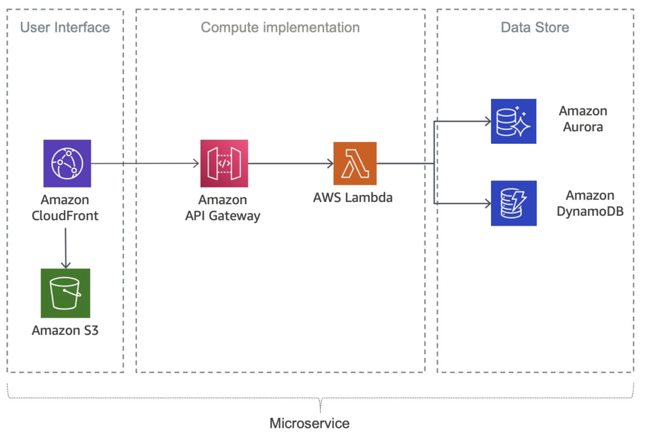
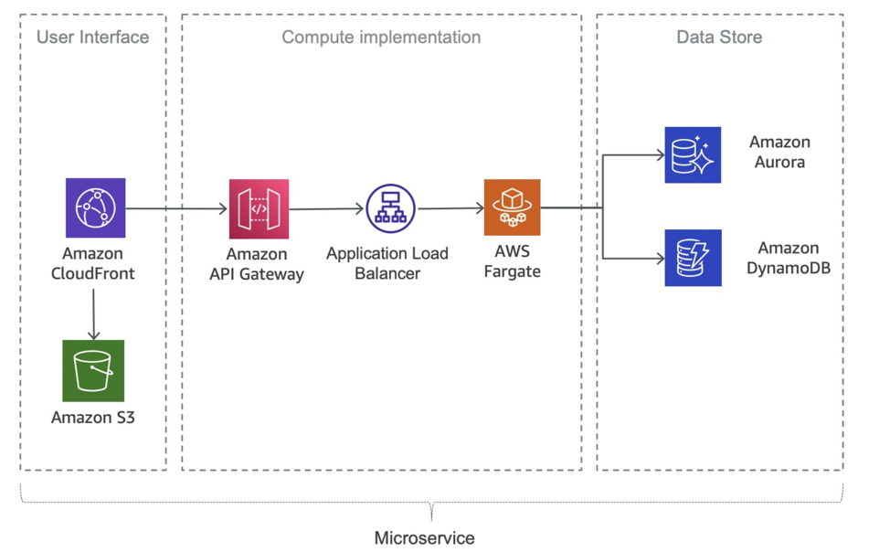

:experimental:
ifndef::env-github[:icons: font]
ifdef::env-github[]
:status:
:outfilesuffix: .adoc
:caution-caption: :fire:
:important-caption: :exclamation:
:note-caption: :paperclip:
:tip-caption: :bulb:
:warning-caption: :warning:
endif::[]

= Microservices
:toc:
:toclevels: 5

Source https://docs.aws.amazon.com/whitepapers/latest/microservices-on-aws/microservices-on-serverless-technologies.html[microservices]

== Serverless technology

*AWS Lambda* and *AWS Fargate*, integrated with API Gateway, allows for the creation of fully serverless applications.

With response streaming, functions can send partial responses back to the client as they become ready, significantly improving the time to first byte, which web and mobile applications are especially sensitive to.

Using containers with AWS Fargate, removing concerns about underlying infrastructure. It also features Amazon Aurora Serverless, an on-demand, auto-scaling database that automatically adjusts capacity based on your application's requirements.

