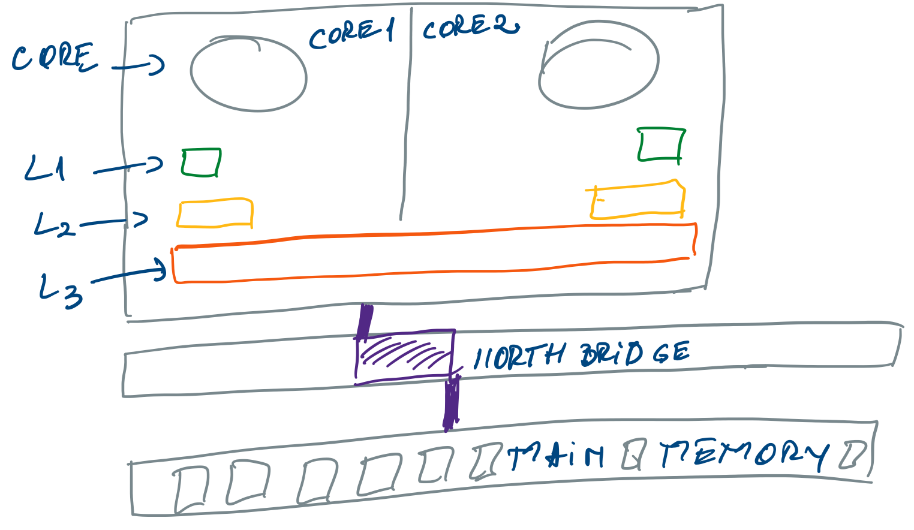

= Concurrency

== Hardware Model
The *clock speed* measures the number of cycles your CPU executes per second, measured in GHz (gigahertz).

A “cycle” is technically a pulse synchronized by an internal oscillator, but for our purposes, they’re a basic unit that helps understand a CPU’s speed. During each cycle, billions of transistors within the processor open and close.

The *northbridge* links the CPU to very high-speed devices, especially RAM and graphics controllers, and the southbridge connects to lower-speed peripheral buses (such as PCIor ISA).
In many modern chipsets, the southbridge contains some on-chip integrated peripherals, such as Ethernet, USB, and audio devices.

== Java Concurrency model

MESI -> Modified-> Exclusive -> Shared -> Invalid

*A Java thread is an OS thread*

Thread.start() calls to the OS to clone() a new thread

Sequence of events for synchronized block:

* Thread needs to modify an object +
Indicates it requires temporary exclusive access to the object
* Thread acquires object monitor  +
May have had to block to acquire
* Thread modifies (or reads) the object +
While locked, object may become briefly inconsistent +
Leaves it in a consistent, legal state when done
* Thread releases the monitor +
Other threads can now acquire

=== Threads
Native Threads - limit

* interrupt -> InterruptedException
** rethrow the exception
** catch and return without rethrowing exception

=== Volatile
* What does volatile do?
Provides 1 operation to or from main memory +
No locking is involved +
Caches are flushed

* The value is: +
Re-read from main memory before use +
Or +
written back to main memory

A *static synchronized method locks the Class object*, because there’s no instance object to lock.

*Locking an Object [ ] doesn’t lock the individual objects.*

*Java’s locks are reentrant*

=== Making a field changes visible

* volatile
* making final - no changes
* read/writes synchronized

=== Issues threads

==== Thread contention
Essentially thread contention is a condition where one thread is waiting for a lock/object that is currently being held by another thread. Therefore, this waiting thread cannot use that object until the other thread has unlocked that particular object.

== Modern JDK Concurrency Classes

Executors has factory methods

* newFixedThreadPool(int nThreads)
* newCachedThreadPool()
* newSingleThreadExecutor()
* newScheduledThreadPool(int corePoolSize)

=== Fixed-size ThreadPool

* Threads will be reused to run multiple tasks
* Prevents having to pay the cost of thread creation
* If threads are in use new tasks are stored in a queue
* Useful if task flow is stable and known

=== CachedThreadPool
* Will create new threads as required
* Will reuse threads where possible
* Created threads are kept for 60 seconds
**  After which they will be removed from the cache
* Can give better performance with small asynchronous tasks
** Or bursty workloads

=== Single Thread Executor
* Backed by a single thread
* Newly submitted tasks are queued until the thread is available
* Can be useful to control number of tasks concurrently executed
* Also useful for testing

The -Xss JVM option allows us to specify the size of the frame stack used by each thread to store local variable, partial results and method calling information.
----
 java -XX:+PrintFlagsFinal -version | grep ThreadStackSize
     intx CompilerThreadStackSize                  = 1024                                   {pd product} {default}
     intx ThreadStackSize                          = 1024                                   {pd product} {default}
     intx VMThreadStackSize                        = 1024                                   {pd product} {default}
openjdk version "11.0.10" 2021-01-19
OpenJDK Runtime Environment AdoptOpenJDK (build 11.0.10+9)
OpenJDK 64-Bit Server VM AdoptOpenJDK (build 11.0.10+9, mixed mode)
----

=== ScheduledThreadPoolExecutor
• Common choice of threadpool for many applications
•  Schedule events to execute at a fixed rate
• Returns a ScheduledFuture for pending execution
• Good for controlled concurrency work

----
ScheduledExecutorService stpe = Executors.newScheduledThreadPool(poolsize);
stpe.scheduleAtFixedRate(msgReader, initialDelay, period, TimeUnit.MILLISECONDS);
----

Schedule all threads to run:

* stpe.invokeAll()
* Executes a bunch of tasks at once
* Returns a collection of Future objects
* Can be beneficial when you have sufficient hardware

Used to shutdown threadpools: shutdown(), shutdownNow()

== Concurrent Data Structures

=== Atomic
AtomicInteger & AtomicLong can be used as counters +
Still lock-free & can’t deadlock

=== ConcurrentHashMap
V7:

* Simple segmented model
* One ReentrantLock object per hash bucket
* Default concurrency level: 16
* So CHM v7 is memory intensive +
~ sizeof(HashMap) + 16 * sizeof(ReentrantLock)

v8:

* In Java 8 implementation of ConcurrentHashMap changes
* Once hash chain crosses threshold
* Replace linked list with balanced tree
* Improves worst-case perf from O(n) to O(log n)

