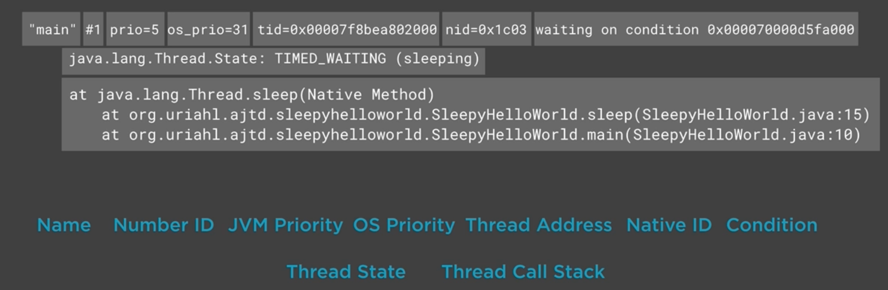

= Thread dumps

== Into

A thread dump - text that represents the runtime state of the program at a particular point in time.

A thread dump is essentially a *snapshot* of all the threads that are currently alive on the Java virtual machine

*Thread Call Stacks*

The thread stack trace - a cascading representation of all the methods the thread has called up to a particular point in time.

*Capturing Thread Dumps*

- Linux space kill signal called SIGQUIT

== The structure of a thread dump

* JVM threads
* Application threads
* Heap report

image::imagesC/structureThreadDump.png[Thread dump]

*Detailed structure of a thread dump*

=== Thread states `java.lang.Thread.State`

* NEW
* RUNNABLE - actively invoking code
* WAITING - will wait indefinitely unless some other thread wakes it up ( e.g. `Object.wait` and `LockSupport.park`)
* TIMED_WAITING - only + timed ( `Thread.sleep` and `LockSupport.parkNanos`)
* BLOCKED - waiting for a monitor lock to become available
* TERMINATED

== Connection Pool Deadlock

Deadlock - a situation where two processes are both blocked by each other, and they're both waiting for each other at the same time.

*Connection Pools*

* a managed, synchronized data structure from which different processes inside our application can borrow a resource such as a connection that they can later use for outbound communication and then "return" that resource once they no longer need it

*Bearer Authentication* - token-based authentication

Tokens are usually ephemeral entities that a user or a machine might use in order to authenticate against the server.

1. A client makes a request to a protected resource.
2. The server sends back a response with a 401 status code ->  not authorized here.
3. The client makes another request to an authentication server in order to retrieve a token.
4. The authentication server sends back a response that contains a token.
5. The client reassembles the original request using the token it just received and makes another attempt at the protected resource.
6. The server identifies the token and grants the client access to that resource.

image::imagesC/blockConnection.png[Block HTTP connection]

Scripts for thread dump

----
# Place this file or copy and paste its content into your ~/.functions file,
# and source this file on your terminal to be able to utilize these functions ('source ~/.functions')

# Helper functions for capturing thread dumps.

# Given a pattern, prints the PID of a process by grepping on the output of 'ps'
pidFromGrep() {
	grep_arg=$1
	grep_arg_length=${#grep_arg}
	first_grep_arg_letter=${grep_arg:0:1}
	rest_of_grep_arg=$(echo $grep_arg| tail -c $grep_arg_length)
	modified_grep_arg="[$first_grep_arg_letter]$rest_of_grep_arg"
	pid=$(ps aux| grep $modified_grep_arg| awk '{print $2}')
	echo $pid
}

# Given a pattern, captures a single thread dump for a process with a PID extracted using the pidFromGrep() function
threadDump() {
	pid=$(pidFromGrep $1)
	kill -3 $pid
}

# Given a pattern, captures the STDOUT of a PID extracted using the pidFromGrep() function
# Taken from: https://stackoverflow.com/a/33844061/4813105
stdoutOf() {
    pid=$(pidFromGrep $1)
    sudo dtrace -p "$pid" -qn '
        syscall::write*:entry
        /pid == $target && arg0 == 1/ {
            printf("%s", copyinstr(arg1, arg2));
        }
    '
}
----
Source: https://app.pluralsight.com/library/courses/analyzing-java-thread-dumps[Thread dumps]

