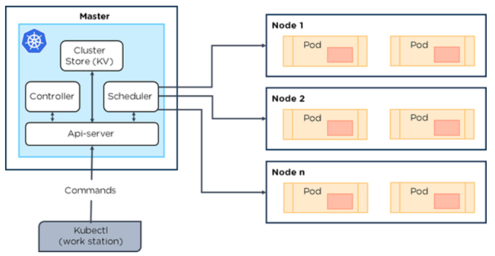

= Devops questions

== Kubernetes

What is Kubernetes::
an open-source system for automating deployment, scaling, and management of containerized applications.

How can containers within a pod communicate with each other::
Containers within a pod share networking space and can reach other on localhost. For instance, if you have two containers within a pod, a MySQL container running on port 3306, and a PHP container running on port 80, the PHP container could access the MySQL one through localhost:3306.

What does a Pod do::
Pods represent the processes running on a cluster.
By limiting pods to a single process, Kubernetes can report on the health of each process running in the cluster. Pods have:

* a unique IP address (which allows them to communicate with each other)
* persistent storage volumes (as required)
* configuration information that determine how a container should run.

Although most pods contain a single container, many will have a few containers that work closely together to execute a desired function.

Source: https://github.com/hubt/kubernetes-faq#how-do-i-build-a-high-availability-ha-cluster

Pods usage patterns::

Pods can be used in two main ways:

* *Pods that run a single container*

The simplest and most common Pod pattern is a single container per pod, where the single container represents an entire application. In this case, you can think of a Pod as a wrapper.

* *Pods that run multiple containers that need to work together*.

Pods with multiple containers are primarily used to support colocated, co-managed programs that need to share resources. These colocated containers might form a single cohesive unit of service—one container serving files from a shared volume while another container refreshes or updates those files. The Pod wraps these containers and storage resources together as a single manageable entity.

Each Pod is meant to run a single instance of a given application. If you want to run multiple instances, you should use one Pod for each instance of the application. This is generally referred to as _*replication*_. Replicated Pods are created and managed as a group by a controller, such as a Deployment.
Source: https://cloud.google.com/kubernetes-engine/docs/concepts/pod

What is a Master Node and what component does it consist of::

Source: https://www.quora.com/What-are-some-important-Kubernetes-concepts

*Master Node*

* The master node is the most vital component responsible for Kubernetes architecture
* It is the central controlling unit of Kubernetes and manages workload and communications across the clusters

Components:

* ETCD
* Controller Manager
* Scheduler
* API Server

*ETCD (Cluster store)*

* This component stores the configuration details and essential values
* It communicates with all other components to receive the commands and work in order to perform an action
* It also manages network rules and posts forwarding activity

*Controller Manager*

* It is responsible for most of the controllers and performs a task
* It is a daemon which runs in a continuous loop and is responsible for collecting and sending information to API server
* The key controllers handle nodes, endpoints, etc.

*Scheduler*

* It is one of the key components of the master node associated with the distribution of workload
* The scheduler is responsible for workload utilization and allocating pod to a new node
* The scheduler should have an idea of the total resources available as well as resources allocated to existing workloads on each node

