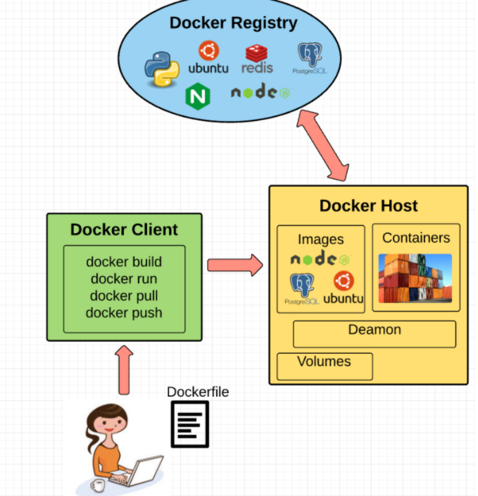
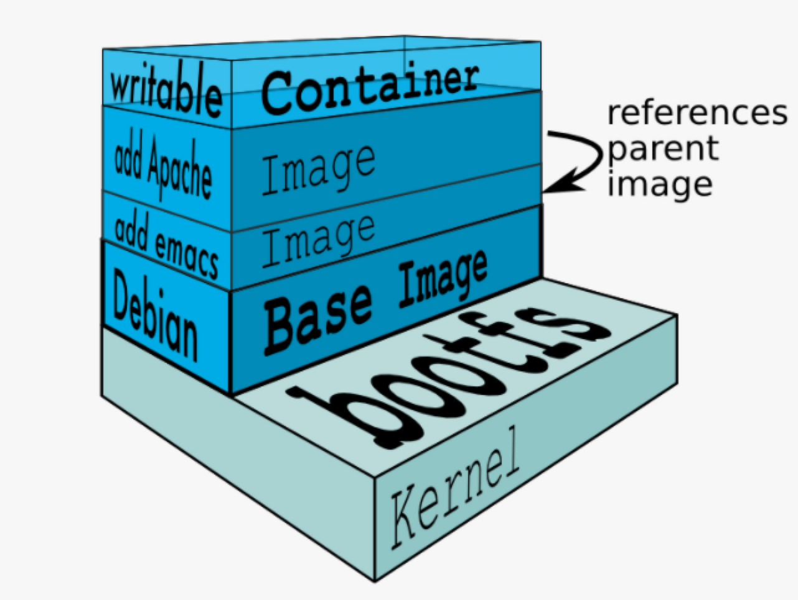

= Container vs VMs

== What are “containers” and “VMs”?
Source: https://medium.com/free-code-camp/a-beginner-friendly-introduction-to-containers-vms-and-docker-79a9e3e119b[VM vs Containers]

* to isolate an application and its dependencies into a self-contained unit that can run anywhere.

=== Virtual Machines

* an emulation of a real computer that executes programs like a real computer.
* VMs run on top of a physical machine using a “hypervisor”.
* A hypervisor, in turn, runs on either a host machine or on “bare-metal”.

A *hypervisor* is a piece of software, firmware, or hardware that VMs run on top of. The hypervisors themselves run on physical computers, referred to as the “host machine”. The host machine provides the VMs with resources, including RAM and CPU.

The VM that is running on the host machine -> “guest machine".

* The VM contains an entire virtualized hardware stack of its own, including virtualized network adapters, storage, and CPU — which means it also has its own full-fledged guest operating system

image::images/VMLayers.png[VM Layers]

=== Containers

A container provides operating-system-level virtualization by abstracting the “user space”

Containers *share* the host system’s kernel with other containers.

image::images/DockerLayers.png[Docker Layers]

Each container gets its own isolated user space to allow multiple containers to run on a single host machine.

Docker is an open-source project based on Linux containers. It uses Linux Kernel features like namespaces and control groups to create containers on top of an operating system.

== Docker

=== Concepts

*Docker Engine*

* the layer on which Docker runs
* a lightweight runtime and tooling that manages containers, images, builds, and more
* runs natively on Linux systems

Composed of:

1. A Docker Daemon that runs in the host computer.
2. A Docker Client that then communicates with the Docker Daemon to execute commands.
3. A REST API for interacting with the Docker Daemon remotely.

*Docker Client*

Docker UI

*Docker Daemon*

* executes commands sent to the Docker Client — like building, running, and distributing your containers.
* runs on the host machine

*Dockerfile*

* file where you write the instructions to build a Docker image.

Instructions can be:

[NOTE]
====
RUN apt-get y install some-package: to install a software package

EXPOSE 8000: to expose a port

ENV ANT_HOME /usr/local/apache-ant to pass an environment variable
and so forth.
====

*Docker Image*

* read-only templates that you build from a set of instructions written in your Dockerfile.
* define both your packaged application and its dependencies setup *and* what processes to run when it’s launched.

* Each instruction in the Dockerfile adds a new “layer” to the image, with layers representing a portion of the images file system that either adds to or replaces the layer below it.
* Docker uses a Union File System to achieve this

*Union File Systems*

* a stackable file system, meaning files and directories of separate file systems (known as branches) can be transparently overlaid to form a single file system.

The contents of directories which have the same path within the overlaid branches are seen as a single merged directory, which avoids the need to create separate copies of each layer.

Instead, they can all be given pointers to the same resource; when certain layers need to be modified, it’ll create a copy and modify a local copy, leaving the original unchanged. That’s how file systems can *appear* writable without actually allowing writes.

Layered systems offer two main benefits:

1. Duplication-free: layers help avoid duplicating a complete set of files every time you use an image to create and run a new container, making instantiation of docker containers very fast and cheap.
2. Layer segregation: Making a change is much faster — when you change an image, Docker only propagates the updates to the layer that was changed.

*Volumes*

Volumes are the “data” part of a container, initialized when a container is created. Volumes allow you to persist and share a container’s data. Data volumes are separate from the default Union File System and exist as normal directories and files on the host filesystem.

So, even if you destroy, update, or rebuild your container, the data volumes will remain untouched. When you want to update a volume, you make changes to it directly

*Docker Containers*

* includes the operating system, application code, runtime, system tools, system libraries, and etc. Docker containers are built off Docker images.
* Since images are read-only, Docker adds a read-write file system over the read-only file system of the image to create a container.

== Inside containers

=== Namespaces

Namespaces provide containers with their own view of the underlying Linux system, limiting what the container can *see and access*.

Types of namespaces:

* NET: Provides a container with its own view of the network stack of the system (e.g. its own network devices, IP addresses, IP routing tables, /proc/net directory, port numbers, etc.).

* PID: PID stands for Process ID. The PID namespace gives containers their own scoped view of processes they can view and interact with, including an independent init (PID 1)

* MNT: Gives a container its own view of the “mounts” on the system.

* UTS: UTS stands for UNIX Timesharing System. It allows a process to identify system identifiers (i.e. hostname, domainname, etc.). UTS allows containers to have their own hostname and NIS domain name that is independent of other containers and the host system.

* IPC: IPC stands for InterProcess Communication. IPC namespace is responsible for isolating IPC resources between processes running inside each container.

* USER: This namespace is used to isolate users within each container. It functions by allowing containers to have a different view of the uid (user ID) and gid (group ID) ranges, as compared with the host system

=== Control groups (cgroups)

* isolates, prioritizes, and accounts for the resource usage (CPU, memory, disk I/O, network, etc.) of a set of processes.
* a cgroup ensures that Docker containers only use the resources they need — and, if needed, set up limits to what resources a container *can* use.
* Cgroups also ensure that a single container doesn’t exhaust one of those resources and bring the entire system down.

== Docker vs Virtual machines

A container image is a lightweight, stand-alone, executable package of a piece of software that includes everything needed to run it.

Docker is the service to run multiple containers on a machine (node) which can be on a vitual machine or on a physical machine.

A virtual machine is an entire operating system (which normally is not lightweight).

Docker Containers have the following benefits:

* Light-weight
* Applications run in isolation
* Occupies less space
* Easily portable and highly secure
* Short boot-up time

Docker is a container-based model where containers are software packages used for executing an application on any operating system
In Docker, the containers share the host OS kernel
Here, multiple workloads can run on a single OS

A virtual machine (VM) is a computing environment or software that aids developers to access an operating system via a physical machine.
they use user space along with the kernel space of an OS

It does not share the host kernel

Each workload needs a complete OS or hypervisor

Since VM uses a separate OS; it causes more resources to be used

Virtual machines don’t start quickly and lead to poor performance

