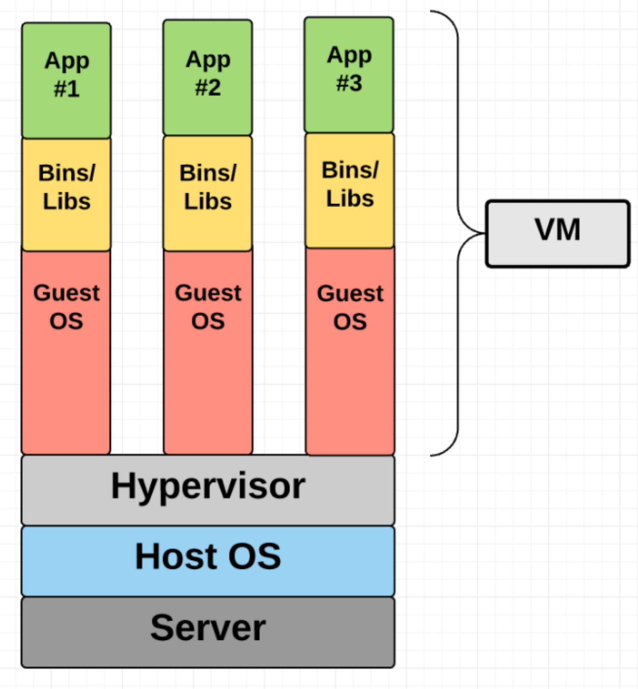
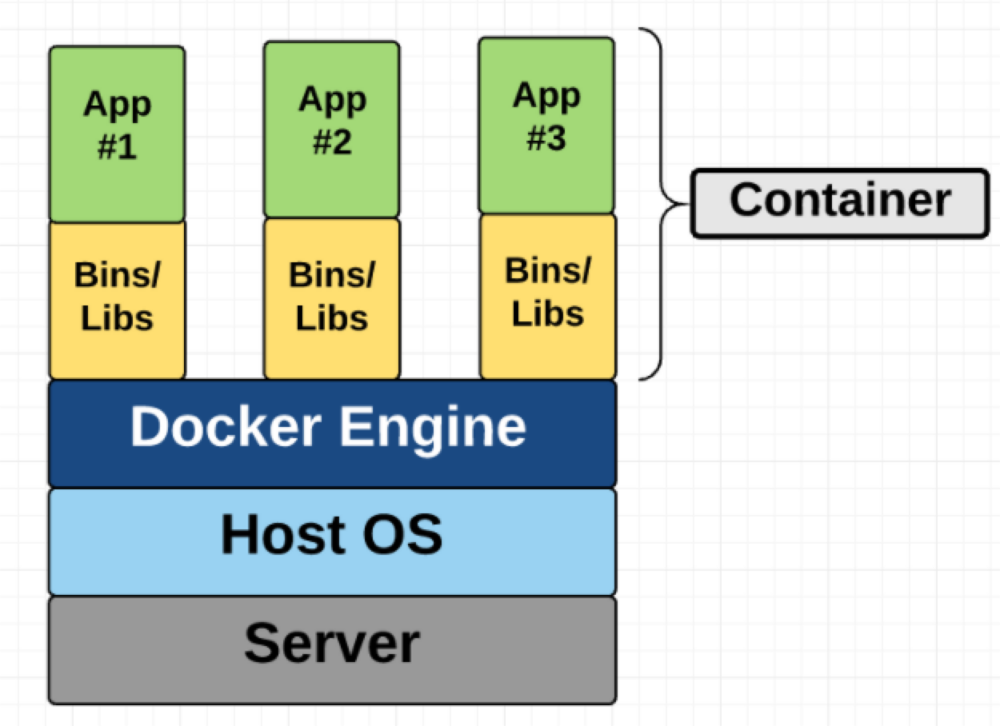

= Container vs VMs

== What are “containers” and “VMs”?
Source: https://medium.com/free-code-camp/a-beginner-friendly-introduction-to-containers-vms-and-docker-79a9e3e119b[VM vs Containers]

* to isolate an application and its dependencies into a self-contained unit that can run anywhere.

=== Virtual Machines

* an emulation of a real computer that executes programs like a real computer.
* VMs run on top of a physical machine using a “hypervisor”.
* A hypervisor, in turn, runs on either a host machine or on “bare-metal”.

A *hypervisor* is a piece of software, firmware, or hardware that VMs run on top of. The hypervisors themselves run on physical computers, referred to as the “host machine”. The host machine provides the VMs with resources, including RAM and CPU.

The VM that is running on the host machine -> “guest machine".

* The VM contains an entire virtualized hardware stack of its own, including virtualized network adapters, storage, and CPU — which means it also has its own full-fledged guest operating system

=== Containers

A container provides operating-system-level virtualization by abstracting the “user space”

Containers *share* the host system’s kernel with other containers.

Each container gets its own isolated user space to allow multiple containers to run on a single host machine.

Docker is an open-source project based on Linux containers. It uses Linux Kernel features like namespaces and control groups to create containers on top of an operating system.

== Docker

=== Concepts

