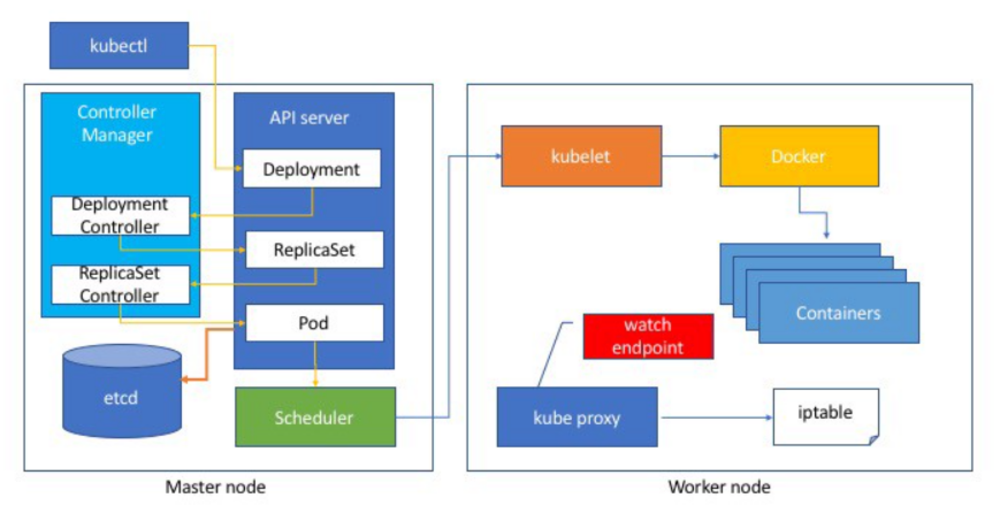
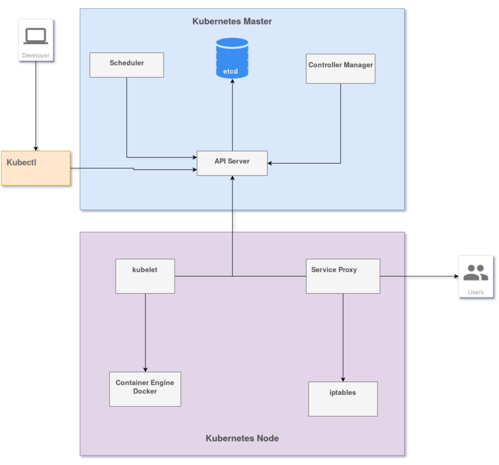

= Kubernetes Architecture

== Overview
Source: https://github.com/Tikam02/DevOps-Guide/blob/master/Container-orchestration/kubernetes/kuber-concepts.md[Kubernetes concepts]

* brings together individual physical or virtual machines into a cluster using a shared network to communicate between each server.

The machines in the cluster are each given a role within the Kubernetes ecosystem.

[IMPORTANT]
.Master
====
One server (or a small group in highly available deployments) functions as the master server.

* This server acts as a gateway and brain for the cluster by exposing an API for users and clients, health checking other servers, deciding how best to split up and assign work (known as “scheduling”), and orchestrating communication between other components

* The master server acts as the primary point of contact with the cluster and is responsible for most of the centralized logic Kubernetes provides.

====

[IMPORTANT]
.Nodes
====
The other machines in the cluster are designated as nodes: servers responsible for accepting and running workloads using local and external resources.

* To help with isolation, management, and flexibility, Kubernetes runs applications and services in containers, so each node needs to be equipped with a container runtime (like Docker or rkt).
* The node receives work instructions from the master server and creates or destroys containers accordingly, adjusting *networking rules* to route and forward traffic appropriately.
====

The applications and services themselves are run on the cluster within containers.

Steps:

* The underlying components make sure that the *desired state* of the applications matches the actual state of the cluster.
* Users interact with the cluster by communicating with the *main API server* either directly or with clients and libraries.
* To start up an application or service, a *declarative plan* is submitted in JSON or YAML defining what to create and how it should be managed.
* The master server then takes the plan and figures out how to run it on the infrastructure by examining the requirements and the current state of the system.
* This group of user-defined applications running according to a specified plan represents Kubernetes’ final layer.

== Kubernetes Components

Source: https://github.com/Tikam02/DevOps-Guide/blob/master/Container-orchestration/kubernetes/kube-advanced.md[Kubernetes Components]

=== Master components

* Master components make global decisions about the cluster (for example, scheduling), and they detect and respond to cluster events (for example, starting up a new pod when a deployment’s replicas field is unsatisfied).

* Master components can be run on any machine in the cluster. However, for simplicity, set up scripts typically start all master components on the same machine, and do not run user containers on this machine.

IMPORTANT: The Kubernetes master runs the Scheduler, Controller Manager, API Server and etcd components and is responsible for managing the Kubernetes cluster.

==== kube-apiserver

* The main implementation of a Kubernetes API server is kube-apiserver.
* The API server is the front end for the Kubernetes control plane.
* designed to scale horizontally—that is, it scales by deploying more instances. You can run several instances of kube-apiserver and balance traffic between those instances.

* When you interact with your Kubernetes cluster using the kubectl command-line interface, you are actually communicating with the master API Server component.

* The API Server is the main management point of the entire cluster.
* The API Server serves up the Kubernetes API and is intended to be a relatively simple server, with most business logic implemented in separate components or in plugins.

[NOTE]
====
* it processes REST operations, validates them, and updates the corresponding objects in etcd.
* The API Server is also responsible for the authentication and authorization mechanism. All API clients should be authenticated in order to interact with the API Server.
* The API Server also implements a watch mechanism (similar to etcd) for clients to watch for changes. This allows components such as the Scheduler and Controller Manager to interact with the API Server in a loosely coupled manner.
====

==== etcd

