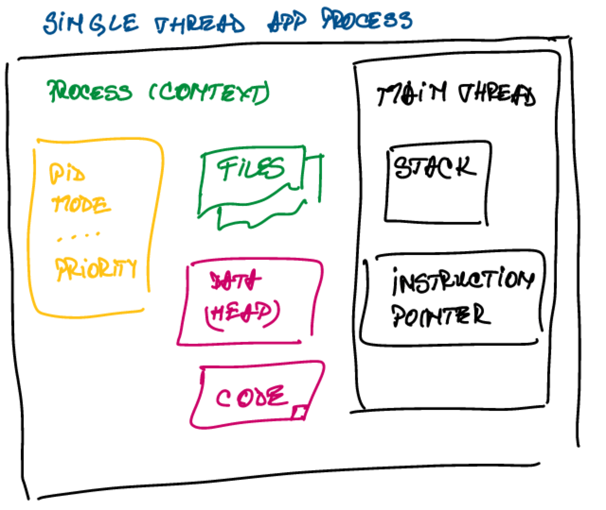
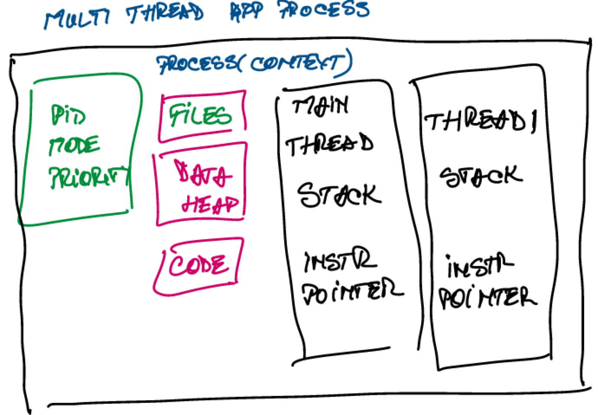
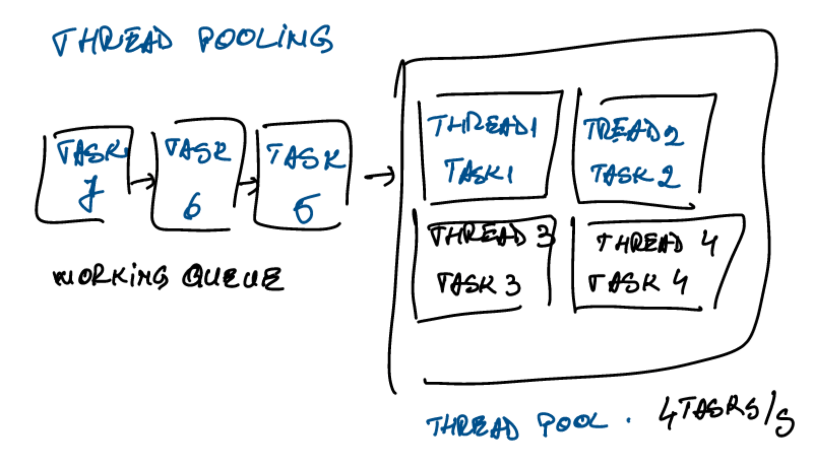

= Java Multithreading

== Concepts

*Concurrency* - achieved by multi-tasking between threads

*Parallelism* - with multiple cores tasks can be run in parallel

A process - is isolated from other process
A process ( context ):

*Stack* - region in memory where local variables are stored and passed into functions

*Instruction pointer* - address of the next instruction to execute

*Context switch*

* is not cheap to switch between threads execution
* each thread consumes resources in the CPU and memory

*Thread scheduling*

OS divides the times into Epochs

*Dynamic priority* = Static priority + Bonus

Static priority = set by dev programmatically
Bonus - adjusted by OS in every epoch by each thread

* Thread vs process
Threads share a lot of data, faster to switch between threads

== Thread termination

Thread consumes resources:

* memory and kernel resources
* CPU cycles and cache memory

*Latency* - the time to completion of a task. Measured in _time units_.

*Throughput* - The amount of tasks completed in a given period. Measured in _tasks/time_ unit

== Performance Optimization

Cost of parallelization and aggregation:

* breaking task into multiple tasks
* thread creation, passing tasks to threads
* time between `thread.start()` to thread getting scheduled
* time until the last thread finishes and signals
* time until the aggregation thread runs
* Aggregation of the subresults into a single artifact

Improve throughput:

- breaking tasks into subtasks

Latency = T/N

T = time to execute original task
N = no subtasks/ no of threads

- running tasks in parallel

Latency = T

*Thread Pooling*

- reusing threads ( create once )

Examples:

- Fixed thread pool executor

== Data sharing between threads

*Stack Memory Region*

* methods are executed
* arguments are passed
* local variables are stored
* all variables belong to the thread executing on that stack
* statically allocated when the thread is created
* the stack's size is fixed and relatively small ( platform specific )
* if calling hierarchy is too long -> StackOverflow Exception

*Heap Memory Region*

Allocated on the heap:

* objects
    ** string, object, collection etc.
* member of classes
* static variables

Heap is managed by Garbage Collector

* Objects stay as long as there is a reference to them
* member of classes exists as long as their parent object exists
* static variables - stay forever

=== Atomic operations

* all reference assignments are atomic
* all getters and setters
* all assignments to primitive types are safe except long and double
* all assignments to references
* all assignments to double and long using volatile keyword

=== Race condition

* Condition when multiple threads are accessing a shared resource
* at least one thread is modifying the resource
* the timing of threads' scheduling may cause incorrect results

=== Data race

* Compiler and CPU may execute the instructions out of order to optimize performance and utilization

Solutions: volatile for shared variables or synchronization of methods which modify shared variables

=== Deadlock

* Mutual Exclusion - only one thread can have exclusive access to a resource
* Hold and Wait - at least one thread is holding a resource and is waiting for another resource
* Non-preemptive allocation - a resource is released only after the thread is done using it
* Circular wait - a chain of at least 2 threads are waiting one on another

Solutions:

* enforce a strict order in a lock acquisition
* tryLock operations

== Locking

=== ReentrantLock

* works as synchronized keyword
* best practice: always call unlock in finally section

* `lock()` method is blocking
* `tryLock()` - returns immediately, non-blocking

== Inter-Thread Communication

* interrupt
* join
* semaphore

=== Objects as condition

* `wait()` - causes the current thread to wait until another thread wakes it up
 ** the thread is not consuming any CPU
* to wake up a thread
 ** `notify()` - wakes up a single thread waiting on that object (random)
 ** `notifyAll()` - wakes up all the threads waiting on that object

* to call any of (wait/notify/notifyAll) - need to acquire the monitor of that object
(use synchronized on that object)

