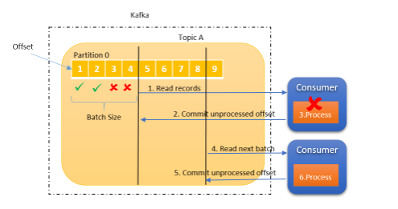
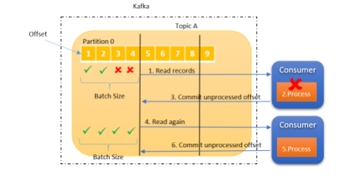

= Kafka consumer

== Clients

OpenSearch rest high level client

== Delivery Semantics

*At most once*

* offsets are committed as soon as the message batch is received.
If the processing goes wrong, the message will be lost ( it won't be read again)

Source: https://www.linkedin.com/pulse/kafka-consumer-delivery-semantics-sylvester-daniel/[delivery semantics]

*At least once*

* offsets are committed after the message is processed
* if the processing goes wrong, the message will be read again.
* this can result in duplicate processing of messages.
* processing needs to be *idempotent*

*Exactly once*

* can be achied for Kafka -> Kafka workflow using Transactional API ( Kafka Steams API)
* Kafka -> Sink workflows use an idempotent consumer

== Offset commit strategies

* enable.auto.commit = true & synchronous processing of batches
* enable.auto.commit = false & manual commit of offsets

