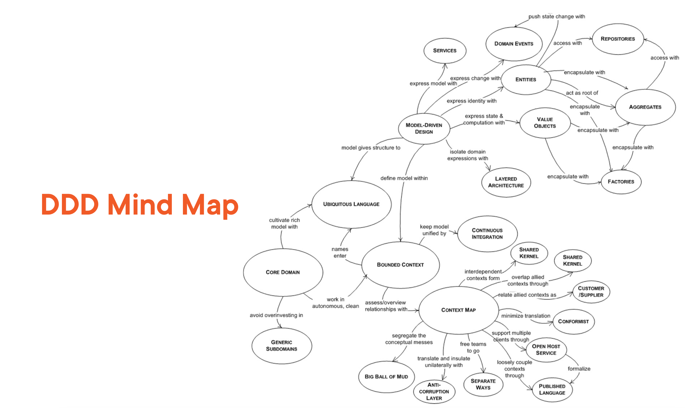
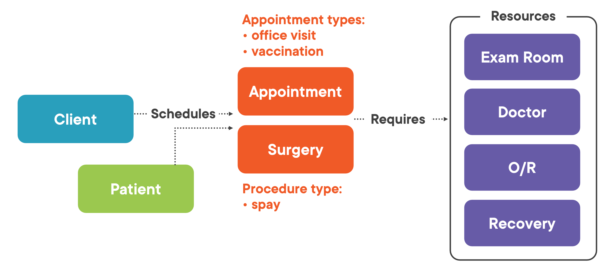
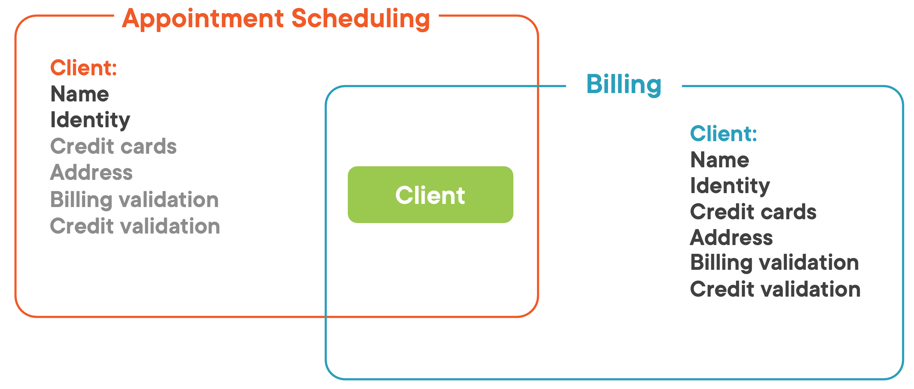

= Domain Driven Design

== Intro

[quote]
Domain-Driven Design is an approach to software development that centers the development on programming a domain model that has a rich understanding of the processes and rules of a domain.”  Martin Fowler

=== Benefits of Domain-Driven Design

* Flexible
* Customer’s vision/perspective of the problem
* Path through a very complex problem
* Well-organized and easily tested code
* Business logic lives in one place
* Many great patterns to leverage

[quote]
DDD aims to tackle business complexity, not technical complexity

[quote]
“While Domain-Driven Design provides many technical benefits, such as maintainability, it should be applied only to complex domains where the model and the linguistic processes provide clear benefits in the communication of complex information, and in the formulation of a common understanding of the domain.”
- Eric Evans, Domain-Driven Design

== Modeling Problems

Domain:

* schedule
* invoices
* payments
* records
* external resources

Findings:

* Understand client’s business
* Identify processes beyond project scope
* Look for subdomains we should include
* Look for subdomains we can ignore

Some of the Identified Subdomains:

* Staff
* Visit records
* Accounting
* Appointment scheduling
* Client and patient records
* Sales

=== Appointment Manager Model

=== Defining Bounded Contexts

* Define a strong boundary around the concepts of each model
* Ensure model’s concepts don’t leak into other models where they don’t make sense

==== Common Types

[quote]
Explicitly define the context within which a model applies... Keep the model strictly consistent within these bounds, but don’t be distracted or confused by issues outside. Eric Evans
