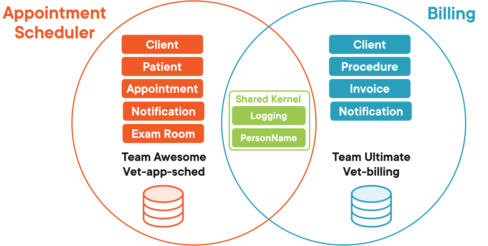
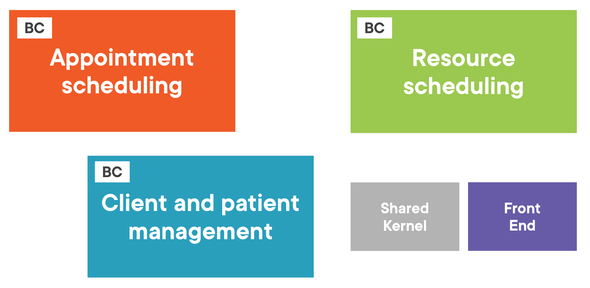

= Domain Driven Design
:toc:

== Intro

[quote]
Domain-Driven Design is an approach to software development that centers the development on programming a domain model that has a rich understanding of the processes and rules of a domain.”  Martin Fowler

=== Benefits of Domain-Driven Design

* Flexible
* Customer’s vision/perspective of the problem
* Path through a very complex problem
* Well-organized and easily tested code
* Business logic lives in one place
* Many great patterns to leverage

[quote]
DDD aims to tackle business complexity, not technical complexity

[quote]
“While Domain-Driven Design provides many technical benefits, such as maintainability, it should be applied only to complex domains where the model and the linguistic processes provide clear benefits in the communication of complex information, and in the formulation of a common understanding of the domain.”
- Eric Evans, Domain-Driven Design

image::../images/dddMindMap.png[Mind map]

== Modeling Problems

Domain:

* schedule
* invoices
* payments
* records
* external resources

Findings:

* Understand client’s business
* Identify processes beyond project scope
* Look for subdomains we should include
* Look for subdomains we can ignore

Some of the Identified Subdomains:

* Staff
* Visit records
* Accounting
* Appointment scheduling
* Client and patient records
* Sales

=== Appointment Manager Model

image::../images/appointmentModel.png[Appoitment Manager Model]

=== Defining Bounded Contexts

* Define a strong boundary around the concepts of each model
* Ensure model’s concepts don’t leak into other models where they don’t make sense

==== Common Types

image::../images/CommonTypes.png[Common types]

[quote]
Explicitly define the context within which a model applies... Keep the model strictly consistent within these bounds, but don’t be distracted or confused by issues outside. Eric Evans

==== Subdomains and Bounded Contexts

Subdomain is a problem space concept.

Bounded Context is a solution space concept.

=== Context Maps

Context Map - Demonstrates how bounded contexts connect to one another while supporting communication between teams.

=== Separate Databases per Bounded Context

[quote]
“If you’re in a company where you share your database and it gets updated by hundreds of different processes, it's very hard to create the kind of models that we're talking about and then write software that does anything interesting with those models.”
Eric Evans

==== Common Patterns for Data Syncing

* Publish subscriber
* 2-way synchronization

Implementations:

* message queues
* database processes
* batch jobs
* synchronization apis
...

=== Specifying Bounded Contexts

*Defining boundaries is the biggest stumbling block.*

Bounded contexts in the Application

=== Ubiquitous Language

The language we use is key to the shared understanding we want to have with our domain experts in order to be successful.

A ubiquitous language applies to a single bounded context and is used throughout conversations and code for that context.

[quote]
Recognize that a change in the ubiquitous language is a change in the model.
Eric Evans

=== Review Concepts

*Problem Domain* -
The specific problem the software you’re working on is trying to solve

*Core Domain* -
The key differentiator for the customer’s business -- something they must do well and cannot outsource

*Subdomains* -
Separate applications or features your software must support or interact with

*Bounded Context* -
A specific responsibility, with explicit boundaries that separate it from other parts of the system

*Context Mapping* -
The process of identifying bounded contexts and their relationships to one another

*Shared Kernel* -
Part of the model that is shared by two or more teams, who agree not to change it without collaboration

*Ubiquitous Language* -
The language using terms from a domain model that programmers and domain experts use to discuss that particular sub-system

== Elements of a Domain Model: Entities

Entity - A domain class with an identity for tracking

A Bounded Context defines the scope and boundaries of a subset of a domain

[quote]
[The Domain Layer is] responsible for representing concepts of the business, information about the business situation, and business rules. State that reflects the business situation is controlled and used here, even though the technical details of storing it are delegated to the infrastructure. This layer is the heart of business software.
Eric Evans

=== Anemic and Rich Domain Models

Anemic

* Looks like the real thing with objects named for nouns in the domain
* Little or no behavior
* Equate to property bags with getters and setters
* All business logic has been relegated to service objects

[quote]
The fundamental horror of this anti-pattern is that it's so contrary to the basic idea of object-oriented design; which is to combine data and process together.
Martin Fowler

=== Understanding Entities

Two Types of Objects in DDD:

* Defined by an identity
* Defined by its values

[quote]
Many objects are not fundamentally defined by their attributes, but rather
by a thread of continuity and identity.
- Eric Evans

Entities Have Identity And Are Mutable

[quote]
User interface should be designed to hide the existence of bounded contexts from end users

==== UUID

GUIDs as Unique Identifiers with No Database Dependency

Database performance favors int for keys

=== Responsibility of Entities

* Entities can get loaded down with logic
* Their core responsibility is identity and life-cycle

[quote]
“Single Responsibility is a good principle to apply to entities. It points you toward the sort of responsibility that an entity should retain. Anything that doesn't fall in that category we ought to put somewhere else.”
- Eric Evans

*Eventual Consistency*
Systems do not need to be strictly synchronized, but the changes will eventually get to their destination.

=== Review Concepts

*Anemic Domain Model* -
Model with classes focused on state management. Good for CRUD.

*Rich Domain Model* -
Model with logic focused on behavior, not just state. Preferred for DDD.

*Entity* -
A mutable class with an identity (not tied to its property values) used for tracking and persistence.

== Value Objects & Services

Value Object Attributes:

* Measures, quantifies, or describes a thing in the domain
* Identity is based on composition of values
* Immutable
* Compared using all values
* No side effects

=== Commonly Used Value Objects

* String is a value object ( immutability)

* Money is a Great Value Object ( value + currency)

* DateTimeRange as Value Object ( start + end)

[quote]
It may surprise you to learn that we should strive to model using Value Objects instead
of Entities wherever possible. Even when a domain concept must be modeled as an Entity, the Entity’s design should be biased toward serving as a value container rather than a child Entity container.
- Vaughn Vernon – Implementing Domain Driven Design

* Value Objects Can Be Used for Identifiers

[quote]
“I think that value objects are a really good place to put methods and logic...because we can do our reasoning without side effects and identity, all those things that make logic tricky. We can put functions on those value objects and do the pure reasoning there.”
- Eric Evans

* Date Libraries as Value Object

[quote]
“Dates are a classic value object and there’s all kinds of logic with them.” - Eric Evans

IMPORTANT: The state of a value object should not be changed once it has been created.

[NOTE]
====
* Generic logic makes sense in value objects
* It’s easier to test logic that’s in a value object
* Entity becomes an orchestrator
====

=== Domain Services

* Some operations make more sense in a domain service.

Features of a Domain Service:

* Not a natural part of an entity or value object
* Has an interface defined in terms of other domain model elements
* Stateless, but may have side effects
* Lives in the core of the application

Examples:

*UI and App*

* Message Sending
* Message Processing
* XML Parsing
* UI Services

*Domain*

* Orchestrating workflow
* Transfer Between Accounts
* Process Order

*Infrastructure*

* Send Email
* Log to a File

=== Review concepts

*Immutable* -
Refers to a type whose state cannot be changed once the object has been instantiated

*Value Object* -
An immutable class whose identity is dependent on the combination of its values

*Domain Services* -
Provide a place in the model to hold behavior that doesn’t belong elsewhere in the domain

*Side Effects* -
Changes in the state of the application or interaction with the outside world (e.g., infrastructure)

== Aggregates and Associations

Large systems often lead to complex data models

