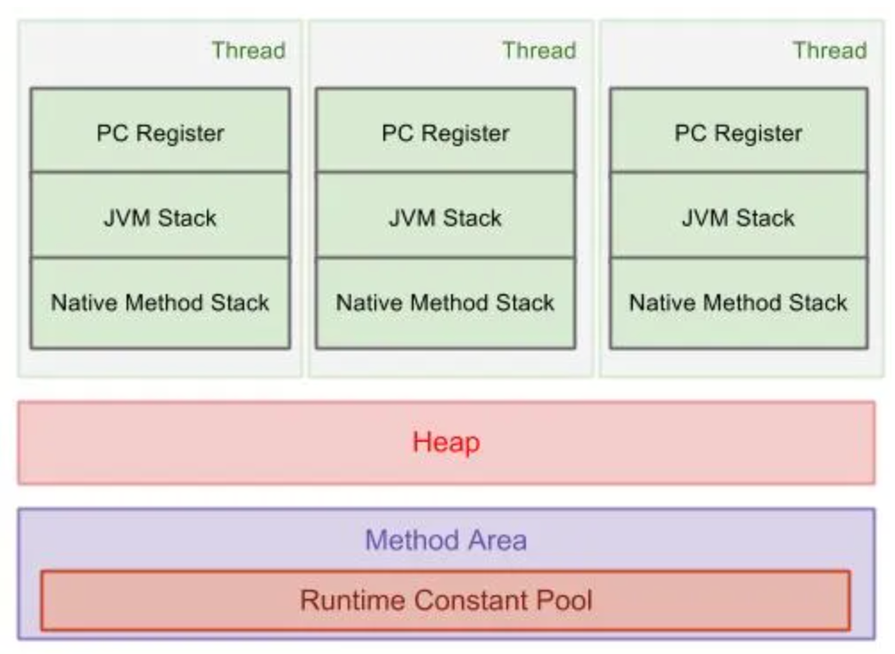
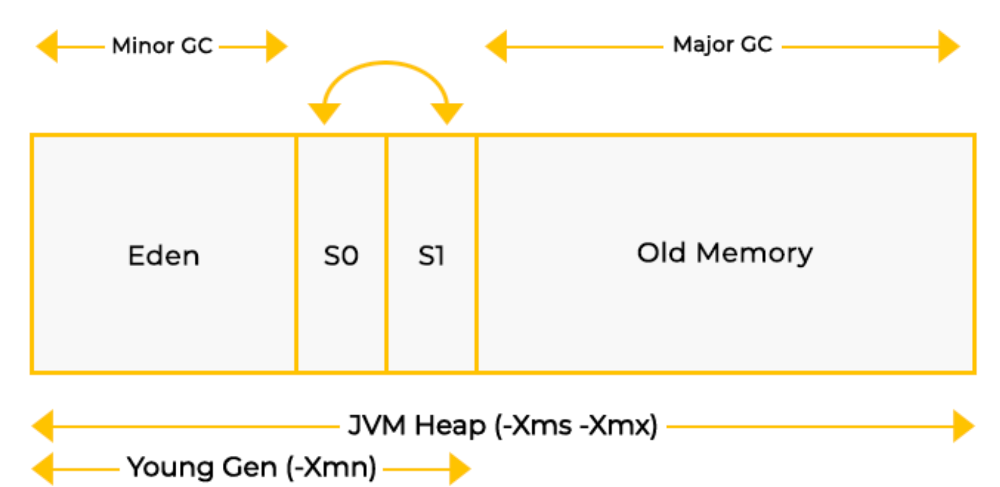
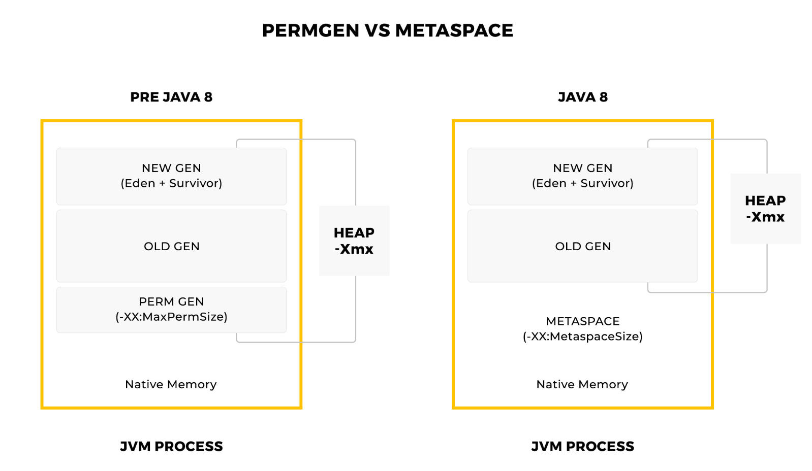

= Memory Areas

== What kinds of memory does the JVM manage?

The JVM manages 2 kind of memory:

* heap
* non-heap - all memory the JVM allocated for purposes oher than the heap

== What are Java Runtime Data areas?

The JVM defines various runtime data areas that are used during execution of a program.

* some are created on JVM start-up and are destroyed only when JVM exits
* other areas are per thread. Per-thread data areas are created when a thread is created and destroyed when the thread exits.

=== JVM Stack

* holding references to heap objects and for storing value types ( primitive types)
* Stack memory in Java is allocated per Thread
* a thread cannot access another thread’s stack memory.

=== Heap

* stores the actual object in memory
* only one heap memory (heap) for each running JVM process
* a shared part of memory regardless of how many threads are running
* The heap memory is periodically garbage collected

=== Program Counter (PC) Register

* The PC register holds the address of the *current instruction*.
* If the current method is native then the PC is undefined
* All CPUs have a PC, typically the PC is incremented after each instruction and holds the address of the next instruction to be executed.
* The JVM uses the PC to keep track of where it is executing instructions, the PC will in fact be pointing at a *memory address in the Method Area*.

=== Method area and Runtime constant pool

* JVM has a common method area across all threads.
* contains per-class elements like constant pool, fields, method local data, method code, constructor codes etc. which are used in class and initialization of objects/interfaces.
* Since Java 1.8, HotSpot now stores the Method Area in a separated native memory space called the *Metaspace*, the max available space is the total available system memory.

=== Native Stack

Methods written in languages other than Java programming languages such as C, C++ are called native methods.
NOTE: When a thread calls a Java method, a new frame is created and is being pushed onto the Java stack.

IMPORTANT: When a thread calls a native method, the thread switches from Java stack to native method stack.
The parameters(if any) are pushed on native method stack.

* If a native method calls back a Java method, the thread leaves the native method stack and enters in Java stack again.

Source: https://www.programcreek.com/2013/04/jvm-run-time-data-areas/[JVM Runtime data areas]

== Explain the different parts of the Heap?

Java’s heap memory consists of the following areas:

* Eden Space
* First Survivor Space
* Second Survivor Space
* Old Generation

The first three areas are grouped under young generation and the fourth area is called old generation.

== What is PermGen space?

NOTE: The permanent generation is defined as the pool containing all the reflective data of the virtual machine itself, such as class and method objects. Note it is part of the HotSpot JVM only.

* The permanent generation is special because it holds meta-data describing user classes (classes that are not part of the Java language).
* The JVM keeps track of loaded class metadata in the PermGen.
* Additionally, the JVM stores all the static content in this memory section. This includes all the static methods, primitive variables, and references to the static objects.
* it contains data about bytecode, names and JIT information

NOTE: Before Java 7 (same as Java 1.7), the String Pool was also part of this memory.

With Java 1.8, metaspace has replaced permgen as its successor.

The garbage collection of the permanent generation would be tied to the garbage collection of the old generation, so whenever either gets full, both the permanent generation and the old generation would be collected

* -XX:PermSize is the initial or minimum size of the PermGen space

* -XX:MaxPermSize is the maximum size

== What is Metaspace?

The metadata has now moved to native memory to an area known as the Metaspace.

* The JDK 8 HotSpot JVM is now using native memory for the representation of class metadata similar to the Oracle JRockit and IBM JVM's.

Each garbage collector in HotSpot needed specialized code for dealing with metadata in the PermGen. Detaching metadata from PermGen not only allows the seamless management of Metaspace, but also allows for improvements such as simplification of full garbage collections and future concurrent de-allocation of class metadata.

== What is the difference between PermGen and Metaspace?

IMPORTANT: while PermGen is contiguous to the Java heap memory, Metaspace is not part of Heap. Rather Metaspace is part of Native Memory (process memory) which is only limited by the Host Operating System.

PermGen always has a fixed maximum size but Metaspace by default auto increases its size depending on the underlying OS.

== What is native memory?

* memory allocated within a process's address space that is not within the heap.
* the JVM also uses memory for its internal operations

* Native memory can also be allocated in applications (via JNI calls to malloc() and similar methods, or when using New I/O, or NIO).

IMPORTANT: The total of native and heap memory used by the JVM yields the total footprint of an application.

Memory areas:

* Metaspace (where class metadata resides)

* Code Cache (storage for JIT-compiled methods and all the generated code)

* Direct ByteBuffers

* Memory-mapped files, including files mapped by JVM, e.g. all JAR files on the classpath

* Thread stacks

* JVM code itself and all the dynamic libraries loaded by Java Runtime

* Other internal JVM structures

The JVM has a feature called *Native Memory Tracking* that can be used to get the detailed breakdown of memory areas used by JVM.

== What is the code cache in Java HotSpot?

In order to run JVM bytecode on different platforms, it needs to be converted to machine instructions. The JIT compiler is responsible for this compilation as the program is executed.

When the JVM compiles bytecode to assembly instructions, it stores those instructions in a special non-heap data area called Code Cache.

== What is string internment?

* store one copy of each unique String and make others refer to the stored copy
* Since the JVM can only intern compile time string constants, we can manually call the intern() method on strings we intend to intern.

* JVM stores interned strings in a special native fixed-sized hashtable called the string table, also known as the String Pool. We can configure the table size (i.e. the number of buckets) via the `-XX:StringTableSize` tuning flag.

