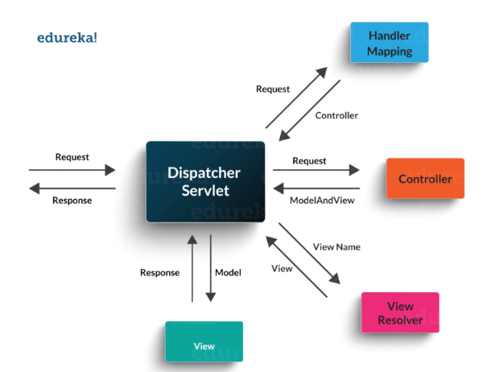
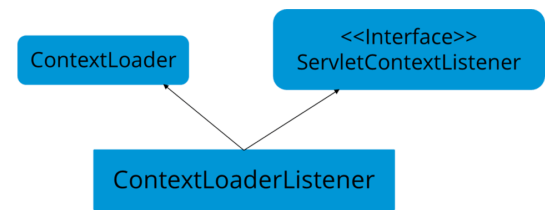

= Spring

== General

=== Advantages of using Spring framework

* Dependency injection makes it possible to write loosely coupled code which is easy to modify and maintain.
* Spring architecture is modular which makes it a lightweight framework. The developer has the choice to pick and choose only those modules which are needed for the application.
* Spring also provides excellent integration with a number of frameworks like Hibernate, Struts, EJB etc.
* The autoconfiguration feature reduces the development time where the developer only focuses on the business logic while Spring takes care of the configuration details.
* Spring supports AOP, which separates business logic from system services.
* Spring provides an API for translating technology-specific exceptions into unchecked exceptions.
* Spring supports testable code and test driven development (TDD).

=== Name the different modules of the Spring framework.
Some of the important Spring Framework modules are:

* Spring Context – for dependency injection.
* Spring AOP – for aspect oriented programming.
* Spring DAO – for database operations using DAO pattern
* Spring JDBC – for JDBC and DataSource support.
* Spring ORM – for ORM tools support such as Hibernate
* Spring Web Module – for creating web applications.
* Spring MVC – Model-View-Controller implementation for creating web applications, web services etc.

=== Describe some standard Spring events

Events provide a way of communication between loosely coupled components. ApplicationContext in Spring publishes certain events during the lifecycle of a Spring application.

Standard Spring events include:

ContextStartedEvent:: triggered when the context is started.
ContextRefreshedEvent:: triggered when the context is either initialized or refreshed using the refresh() method.
ContextStoppedEvent:: triggered when the context is stopped using the stop() method.
ContextClosedEvent:: triggered when the close() method is called on the ApplicationContext.
RequestHandledEvent:: triggered to let all beans know that an HTTP request has been handled.

=== List some of the important annotations in annotation-based Spring configuration.

The important annotations are:

@Required
@Autowired
@Qualifier
@Resource
@PostConstruct
@PreDestroy

=== Explain Bean in Spring and List the different Scopes of Spring bean.

Beans are objects that form the backbone of a Spring application. They are managed by the Spring IoC container. In other words, a bean is an object that is instantiated, assembled, and managed by a Spring IoC container.

There are five Scopes defined in Spring beans.

Singleton:: Only one instance of the bean will be created for each container. This is the default scope for the spring beans. While using this scope, make sure spring bean doesn’t have shared instance variables otherwise it might lead to data inconsistency issues because it’s not thread-safe.
Prototype:: A new instance will be created every time the bean is requested.
Request:: This is same as prototype scope, however it’s meant to be used for web applications. A new instance of the bean will be created for each HTTP request.
Session:: A new bean will be created for each HTTP session by the container.
Global-session:: This is used to create global session beans for Portlet applications.

=== Explain the role of DispatcherServlet and ContextLoaderListener.

*DispatcherServlet* is basically the front controller in the Spring MVC application as it loads the spring bean configuration file and initializes all the beans that have been configured. If annotations are enabled, it also scans the packages to configure any bean annotated with @Component, @Controller, @Repository or @Service annotations.

Source: https://www.edureka.co/blog/interview-questions/java-interview-questions/#Spring

*ContextLoaderListener*, on the other hand, is the listener to start up and shut down the WebApplicationContext in Spring root. Some of its important functions includes tying up the lifecycle of Application Context to the lifecycle of the ServletContext and automating the creation of ApplicationContext.

=== How to handle exceptions in Spring MVC Framework?
Spring MVC Framework provides the following ways to help us achieving robust exception handling.

Controller Based::
We can define exception handler methods in our controller classes. All we need is to annotate these methods with @ExceptionHandler annotation.

Global Exception Handler::
Exception Handling is a cross-cutting concern and Spring provides @ControllerAdvice annotation that we can use with any class to define our global exception handler.

HandlerExceptionResolver implementation::
For generic exceptions, most of the times we serve static pages. Spring Framework provides HandlerExceptionResolver interface that we can implement to create global exception handler. The reason behind this additional way to define global exception handler is that Spring framework also provides default implementation classes that we can define in our spring bean configuration file to get spring framework exception handling benefits.

