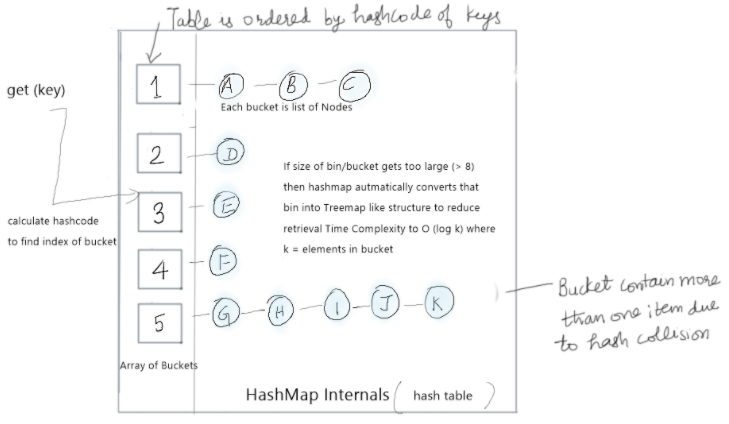

= Java Collections

== What is difference between ArrayList and LinkedList?
ArrayList and LinkedList both implements List interface and maintains insertion order. Both are non synchronized classes.

|===
|ArrayList|LinkedList

|ArrayList internally uses a dynamic array to store the elements.
|LinkedList internally uses a doubly linked list to store the elements.

|Manipulation with ArrayList is slow because it internally uses an array. If any element is removed from the array, all the bits are shifted in memory.
|Manipulation with LinkedList is faster than ArrayList because it uses a doubly linked list, so no bit shifting is required in memory.

|An ArrayList class can act as a list only because it implements List only.
|LinkedList class can act as a list and queue both because it implements List and Deque interfaces.

|ArrayList is better for storing and accessing data.
|LinkedList is better for manipulating data.

|===

== How HashMap works in Java?
HashMap in Java works on hashing principle. It is a data structure which allow to store object and retrieve it in constant time O(1). In hashing, hash functions are used to link key and value in HashMap. Objects are stored by calling put(key, value) method of HashMap and retrieved by calling get(key) method. When we call put method, hashcode() method of the key object is called so that hash function of the map can find a bucket location to store value object, which is actually an index of the internal array, known as the table. HashMap internally stores mapping in the form of Map.Entry object which contains both key and value object.

Since the internal array of HashMap is of fixed size, and if you keep storing objects, at some point of time hash function will return same bucket location for two different keys, this is called collision in HashMap. In this case, a linked list is formed at that bucket location and a new entry is stored as next node.

If we try to retrieve an object from this linked list, we need an extra check to search correct value, this is done by equals() method. Since each node contains an entry, HashMap keeps comparing entry's key object with the passed key using equals() and when it return true, Map returns the corresponding value.

== How does HashMap handle collisions in java?
Prior to Java 8, HashMap and all other hash table based Map implementation classes in Java handle collision by chaining, i.e. they use linked list to store map entries which ended in the same bucket due to a collision. If a key end up in same bucket location where an entry is already stored then this entry is just added at the head of the linked list there. In the worst case this degrades the performance of the get() method of HashMap to O(n) from O(1). In order to address this issue in the case of frequent HashMap collisions, Java 8 has started using a balanced tree instead of linked list for storing collided entries. This also means that in the worst case you will get a performance boost from O(n) to O(log n).

The threshold of switching to the balanced tree is defined as TREEIFY_THRESHOLD constant in java.util.HashMap JDK 8 code. Currently, it's value is 8, which means if there are more than 8 elements in the same bucket than HashMap will use a tree instead of linked list to hold them in the same bucket.

== What is Java Priority Queue?
A priority queue in Java is a special type of queue wherein all the elements are ordered as per their natural ordering or based on a custom Comparator supplied at the time of creation.

*Features*

* PriorityQueue is an unbounded queue and grows dynamically.
* It does not allow NULL objects.
* Objects added to PriorityQueue MUST be comparable.
* The objects of the priority queue are ordered by default in natural order.
* A Comparator can be used for custom ordering of objects in the queue.
* The head of the priority queue is the least element based on the natural ordering or comparator based ordering. When we poll the queue, it returns the head object from the queue.
* If multiple objects are present of same priority the it can poll any one of them randomly.
* PriorityQueue is not thread safe. Use PriorityBlockingQueue in concurrent environment.
* It provides O(log(n)) time for add and poll methods.

== What is LinkedHashMap in Java?
LinkedHashMap is just like HashMap with an additional feature of maintaining an order of elements inserted into it. +
Java LinkedHashMap class is Hashtable and Linked list implementation of the Map interface, with predictable iteration order.

*Features*

* Java LinkedHashMap contains values based on the key.
* Java LinkedHashMap contains unique elements.
* Java LinkedHashMap may have one null key and multiple null values.
* Java LinkedHashMap is non synchronized.
* Java LinkedHashMap maintains insertion order.
* The initial default capacity of Java HashMap class is 16 with a load factor of 0.75.

== What is the difference between fail-fast and fail-safe iterator?

*fail-fast Iterator*

Iterators in java are used to iterate over the Collection objects.Fail-Fast iterators immediately throw ConcurrentModificationException if there is structural modification of the collection. Structural modification means adding, removing or updating any element from collection while a thread is iterating over that collection. Iterator on ArrayList, HashMap classes are some examples of fail-fast Iterator.

*fail-safe Iterator*

Fail-Safe iterators don’t throw any exceptions if a collection is structurally modified while iterating over it. This is because, they operate on the clone of the collection, not on the original collection and that’s why they are called fail-safe iterators. Iterator on CopyOnWriteArrayList, ConcurrentHashMap classes are examples of fail-safe Iterator.

== What is BlockingQueue? How to implement producer-consumer problem by using BlockingQueue?

BlockingQueue: When a thread try to dequeue from an empty queue is blocked until some other thread inserts an item into the queue. Also, when a thread try to enqueue an item in a full queue is blocked until some other thread makes space in the queue, either by dequeuing one or more items or clearing the queue completely.

Producter-Consumer Problem

Producer and Consumer are two separate threads which share a same bounded Queue. The role of producer to produce elements and push to the queue. The producer halts producing if the queue is full and resumes producing when the size of queue is not full. The consumer consumes the element from the queue. The consumers halt consuming if the size of queue is 0 (empty) and resumes consuming once the queue has an element.

The problem can be approached using various techniques

* Using wait() and notifyAll()
* Using BlockingQueue
* Using semaphores

----
public class ProducerConsumerBlockingQueue {

  static int MAX_SIZE = 5;
  static BlockingQueue queue = new LinkedBlockingQueue(MAX_SIZE);

  public static void main(String[] args) {

    Producer producer = new Producer();
    Consumer consumer = new Consumer();
    producer.start();
    consumer.start();
  }

  static class Producer extends Thread {
    Random random = new Random();

    public void run() {
      while (true) {
        int element = random.nextInt(MAX_SIZE);
        try {
          queue.put(element);
        } catch (InterruptedException e) {
        }
      }
    }
  }

  static class Consumer extends Thread {
    public void run() {
      while (true) {
        try {
          System.out.println("Consumed " + queue.take());
        } catch (InterruptedException e) {
          e.printStackTrace();
        }
      }
    }
  }
}
----

----
Output

Producer 2
Producer 3
Consumed 2
Consumed 3
Producer 0
Producer 4
Consumed 0
----

== What is difference between Iterator and ListIterator?
ListIterator is the child interface of Iterator interface. The major difference between Iterator and ListIterator is that Iterator can traverse the elements in the collection only in forward direction whereas, the ListIterator can traverse the elements in a collection in both the forward as well as the backwards direction.

== What is difference between size and capacity of HashMap/ArrayList
Size defines the actual number of elements contained in the collection, while capacity at any given point in time defines the number of items that a collection can hold without growing itself.

== What is Load Factor in HashMap Context?
The load factor is a measure of how full the hash table is allowed to get before its capacity is automatically increased. Default initial capacity of the HashMap takes is 16 and load factor is 0.75f (i.e 75% of current map size). The load factor represents at what level the HashMap capacity should be doubled.

== By what amount ConcurrentHashMap/hashMap grows when its capacity is reached?
Whenever threshold (defined by load factor with default value of 0.75) of HashMap reached, it increases its size to double. Signed Left shift operator is used to double the capacity of hashmap, as shown in code below

`newCap = oldCap << 1`

== What is a default capacity of ArrayList, Vector, HashMap, Hashtable and Hashset?

|===
|Collections|Capacity

|ArrayList
|10

|Vector
|10

|HashSet
|16

|HashMap
|16

|HashTable
|11

|HashSet
|16

|===

== How Set/HashSet implement unique values?
Java HashSet class is used to create a collection that uses a hash table for storage. It inherits the AbstractSet class and implements Set interface.

HashSet stores the elements by using a mechanism called hashing.
HashSet contains unique elements only.
HashSet allows null value.

When we create a HashSet, it internally creates a HashMap and if we insert an element into this HashSet using add() method, it actually call put() method on internally created HashMap object with element you have specified as it’s key and constant Object called PRESENT as it’s value. So we can say that a Set achieves uniqueness internally through HashMap.

== What is the difference between HashSet and TreeSet?

* HashSet gives better performance (faster) than TreeSet for the operations like add, remove, contains, size etc. HashSet offers constant time cost while TreeSet offers log(n) time cost for such operations.

* HashSet does not maintain any order of elements while TreeSet elements are sorted in ascending order by default.

== Internals of ConcurrentHashmap
A ConcurrentHashMap is a hashmap supporting full concurrency of retrieval via volatile reads of segments and tables without locking, and adjustable expected concurrency for updates.

The allowed concurrency among update operations is guided by the optional concurrencyLevel constructor argument (default is16), which is used as a hint for internal sizing.

Source: https://www.javacodemonk.com/discuss-internals-of-a-concurrenthashmap-chm-in-java-b537d34e[CHM internals]

ConcurrentHashMap is similar in implementation to that of HashMap, with resizable array of hash buckets, each consisting of List of HashEntry elements.
Instead of a single collection lock, ConcurrentHashMap uses a *fixed pool of locks* that form a partition over the collection of buckets.

HashEntry class takes advantage of final and volatile variables to reflect the changes to other threads without acquiring the expensive lock for read operations.

The table inside ConcurrentHashMap is divided among Segments (which extends Reentrant Lock), each of which itself is a concurrently readable hash table. Each segment uses single lock to consistently update its elements flushing all the changes to main memory.

*put()* method holds the bucket lock for the duration of its execution and doesn’t necessarily block other threads from calling get() operations on the map. +
It firstly searches the appropriate hash chain for the given key and if found, then it simply updates the volatile value field. Otherwise it creates a new HashEntry object and inserts it at the head of the list.

*Iterator* returned by the ConcurrentHashMap is *fail-safe* but weakly consistent. keySet().iterator() returns the iterator for the set of hash keys backed by the original map. The iterator is a “weakly consistent” iterator that will never throw ConcurrentModificationException, and guarantees to traverse elements as they existed upon construction of the iterator, and may (but is not guaranteed to) reflect any modifications subsequent to construction.

|===
|Property |Value

|Time Complexity for Put, get, remove and containsKey
|O(1) when no collision, O(1 + log k) when k elements are present in one bucket

|CHM allows concurrent reads from different threads
|Yes

|CHM allows concurrent writes from different threads
|Yes

|Default Concurrency Level
|16
|===

