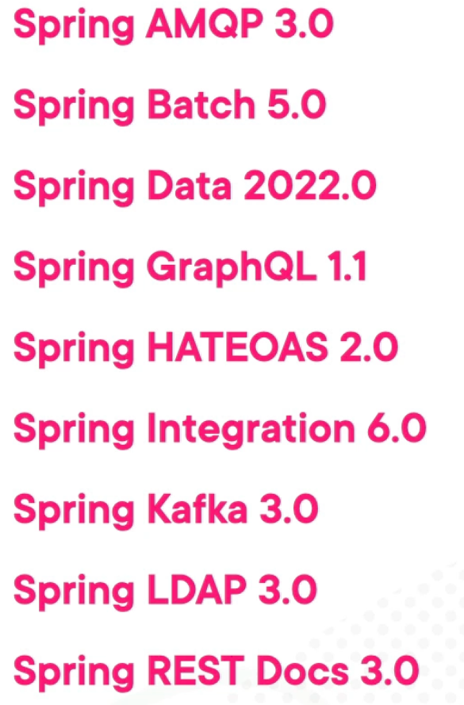

= Spring boot 3

== Java 17

=== Records

* immutability

* private, final field for each piece of data
* getter for each field
* public constructor with a corresponding argument for each field
* `equals` method that returns true for objects of the same class when all fields match
* `hashCode` method that returns the same value when all fields match
* `toString` method that includes the name of the class and the name of each field and its corresponding value

[java]
----
public class Person {

    private final String name;
    private final String address;

    public Person(String name, String address) {
        this.name = name;
        this.address = address;
    }

    @Override
    public int hashCode() {
        return Objects.hash(name, address);
    }

    @Override
    public boolean equals(Object obj) {
        if (this == obj) {
            return true;
        } else if (!(obj instanceof Person)) {
            return false;
        } else {
            Person other = (Person) obj;
            return Objects.equals(name, other.name)
              && Objects.equals(address, other.address);
        }
    }

    @Override
    public String toString() {
        return "Person [name=" + name + ", address=" + address + "]";
    }

    // standard getters
}
----

[java]
----
public record Person (String name, String address) {}
----

* Override equads/hashcode

[java]
----
import java.util.Objects;

record Movie(String name, Integer yearOfRelease, String distributor) {

    @Override
    public boolean equals(Object other) {
        if (this == other) {
            return true;
        }
        if (other == null) {
            return false;
        }
        if (!(other instanceof Movie)) {
            return false;
        }

        Movie movie = (Movie) other;
        if (movie.name.equals(this.name) && movie.yearOfRelease.equals(this.yearOfRelease)) {
            return true;
        }
        return false;
    }

    @Override
    public int hashCode() {
        return Objects.hash(name, yearOfRelease);
    }
}
----

=== Text Block

[java]
----
String value = """
            Multi-line
            Text
            """;
----

=== Switch Expressions

* Java 17 enables us to use pattern matching
* there's no need for explicit break statements to prevent fall through

[java]
----
double circumference = switch(shape) {
    case Rectangle r -> 2 * r.length() + 2 * r.width();
    case Circle c -> 2 * c.radius() * Math.PI;
    default -> throw new IllegalArgumentException("Unknown shape");
};
----

==== Pattern Matching
Pattern matching addresses a common logic in a program, namely the conditional extraction of components from objects, to be expressed more concisely and safely.

* Enhanced instanceOf Operator

[java]
----
if (obj instanceof Address) {
    Address address = (Address) obj;
    city = address.getCity();
}
----

[java]
----
if (obj instanceof Address address) {
    city = address.getCity();
}
----

== Spring Boot 3

* the package namespace changed from javax.* to jakarta.*.

----
import javax.servlet.http.HttpServletRequest;
----

----
import jakarta.servlet.http.HttpServletRequest;
----

== Spring 6

=== Versions

* Spring Retry 2.0
* Spring Security 6.0
* Spring Session 3.0
* Spring WS 4.0

=== Core

* `@inject` in  `jakarta.inject`
* `@PostConstruct` and `@PreDestroy` in `jakarta.annotation`
* constructor preferred over field injection

