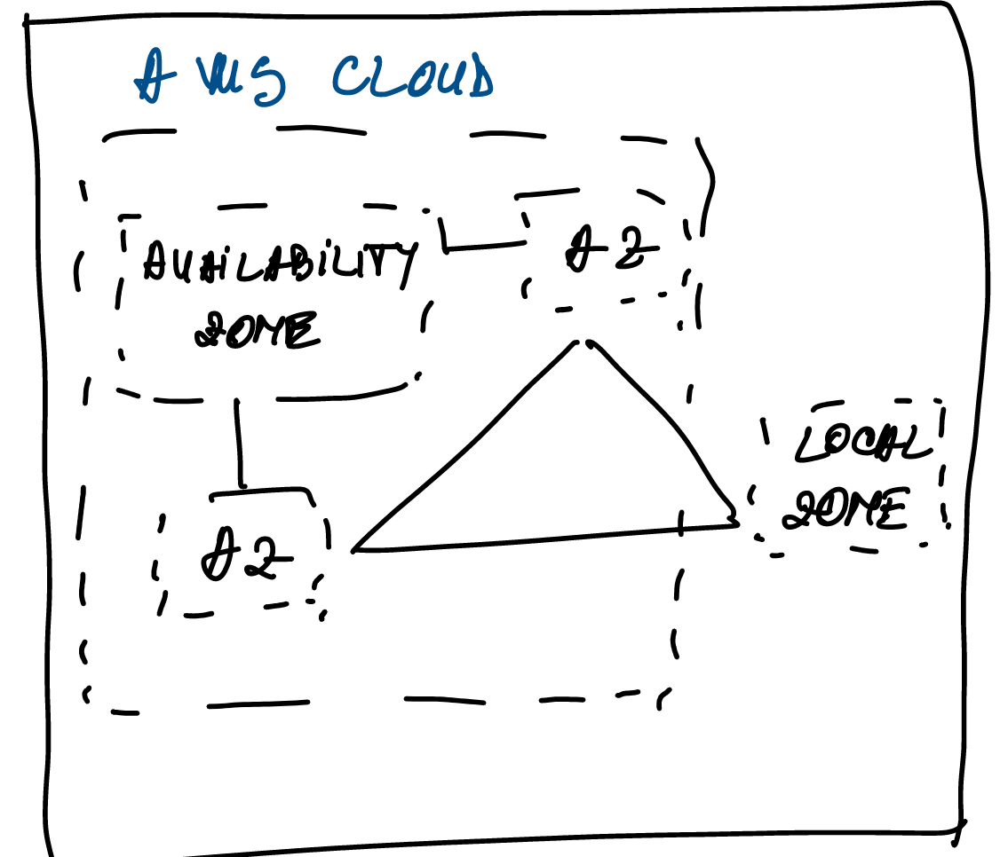
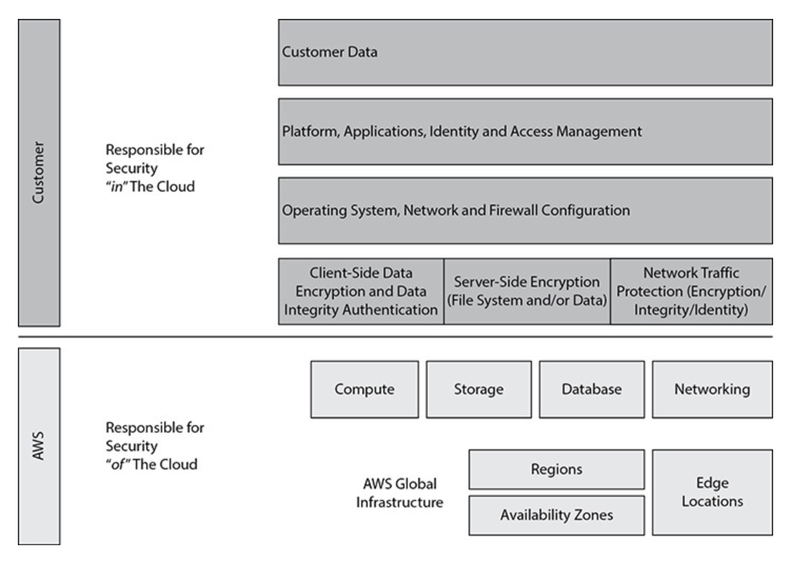

= AWS

== Availability zone - AZ

An AZ consists of one to six data centers, with redundant power supplies and networking connectivity.
A single data center can be part of only one AZ. Each AZ is located in a different floodplain; power grids are designed in such a way that a natural calamity or disaster does not impact multiple AZs

The networking among the AZs in a particular region is designed in such a way that it offers inexpensive, low-latency, private, fiber-optic network connectivity to another AZ in the same region. The latency between the AZs within a region is less than a single digit.

AWS offers edge locations, or points of presence (POPs), to provide a better user experience to customers

AWS has recently added regional edge cache locations between the main servers and the edge locations. When an object is not accessed for a long time, it goes out of the cache, but because the regional edge cache maintains a larger cache, the object can be stored there for a longer amount of time. If an application accesses the object again, it does not have to go to the main server for the access. When the application is not able to find the object in the edge location, it looks for the file in the regional edge cache.

== AWS Security and Compliance

*shared security*:

* AWS is responsible for the security of the cloud
* customers are responsible for the security in the cloud.

AWS is responsible for the physical security of the data centers.

Customers are responsible for securing the application, the data being hosted.

A managed service (for example, Amazon RDS, Amazon Redshift, Amazon DynamoDB, and so on), AWS is also responsible for the security configuration of it.

== AWS Products and Services

=== Amazon Elastic Compute Cloud

EC2 - includes the virtual servers, called instances

=== Amazon EC2 Auto Scaling

Amazon EC2 Auto Scaling helps in automatically scaling the Amazon EC2 instances up and down as per the policies you define.

If for some reason an instance goes down, Amazon EC2 Auto Scaling quickly spins up a new instance.

=== AWS Lambda

AWS Lambda enables you to run code without provisioning or managing any servers or infrastructure. You can run any code for any kind of application or back-end service. You simply develop code for your application or back-end service and define the event triggers with the AWS Lambda service.

=== Amazon EC2 Container Service

ECS -  allows you to run Docker containers on Amazon EC2 instances.

=== Amazon Elastic Kubernetes Service

Amazon EKS - is a fully managed Kubernetes service that makes it easy for you to run your code on AWS without needing to install and operate your own Kubernetes control plane or worker nodes

=== AWS Fargate

AWS Fargate is a serverless compute engine for containers that works with both Amazon ECS and Amazon EKS

=== AWS Elastic Beanstalk

AWS Elastic Beanstalk lets you run and manage web applications without worrying about the underlying infrastructure.

=== Amazon Lightsail

Amazon Lightsail is the simplest way to get started with AWS for small businesses, developers, students

=== AWS Batch

AWS Batch enables users to efficiently run hundreds of thousands of batch computing jobs on AWS

=== AWS Outposts

AWS Outposts help in extending AWS services to any data center.

== Networking

=== Amazon Virtual Private Cloud

* your own data center in the cloud.
* have complete control over the networking in an Amazon VPC.
* can bring your own IP addresses, can define the subnets as you want, and have full control over the route table and network gateways.

=== Amazon Route 53

* Domain Name System (DNS) web service
* highly available and scalable, and its SLA is 100 percent uptime
* IPv4 and IPv6 compliant
* manage failover from primary to secondary hosted applications

=== Elastic Load Balancing

* automatically distribute the load across multiple Amazon EC2 instances.
* supports load balancing of HTTP, HTTPS, and TCP traffic to Amazon EC2 instances.
* can be integrated with Auto Scaling
* can automatically scale up and down your Amazon EC2 instance and dynamically grow and shrink your operation depending on the traffic
* ELB helps you to achieve fault tolerance for your applications

=== AWS Direct Connect

* establish private, dedicated network connectivity from your data center to AWS.
* AWS Direct Connect can be used from either your data center or your office or colocation.
* can reduce bandwidth costs for high-volume data transfers and get consistent network performance.

=== AWS App Mesh

* helps monitor, control, debug, and trace communications between services
* can be used with services running on EC2 as well as with microservice containers

=== AWS Global Accelerator

* improves the availability and performance of your applications for global users.
* provides a set of static IP addresses that are anycast from the AWS edge network, which provides a fixed entry point to your applications and eliminates the complexity of managing specific IP addresses for different AWS regions and AZs.

== Security and Compliance

=== AWS Identity and Access Management
* create users, groups, and roles
* manage and control access to AWS services and resources.

=== Amazon Inspector

* an automated security assessment service that helps you to identify the security vulnerabilities in your application when it is being deployed as well as when it is running in a production system

=== AWS Certificate Manager

* manage Secure Sockets Layer (SSL) certificates for use with AWS services.
* provision, manage, and deploy SSL/Transport Layer Security (TLS) certificates.

=== AWS Directory Service

* an AWS managed directory service built on Microsoft Active Directory.
* to manage directories in the cloud.

=== AWS Web Application Firewall

* a web application firewall that detects malicious traffic targeted at the web applications.
* Using WAF, you can create various rules with which you can protect against common attacks such as SQL injection and scripting.
* Using these rules, you can block the web traffic from certain IP addresses, filter certain traffic from certain geographical locations, and so on, thus safeguarding your application.

=== AWS Shield
* a managed service that protects against distributed denial-of-service (DDoS) attacks targeted at the web applications.
* *AWS Shield Standard* is free and protects against most commonly occurring DDoS attacks against web applications.
* *AWS Shield Advanced* - higher levels of protection targeting not only against web applications but also Elastic Load Balancer, Amazon CloudFront, and Amazon Route 53.

=== Amazon GuardDuty
* a threat-detection service that continuously monitors your AWS accounts and workloads to protect them.
* monitors and analyzes the data generated from your account and all the network activities from AWS CloudTrail Events, Amazon VPC Flow Logs, and DNS logs

=== Amazon Macie
* protect your data in Amazon S3 by helping you classify what data you have, the business value of that data, and the behavior associated with access to that data.

* uses machine learning to recognize sensitive data such as personally identifiable information (PII) or intellectual property, assigns a business value, and provides visibility into where this data is stored and how it is being used in your organization

=== AWS Secrets Manager

* manage secrets such as database credentials, on-premise resource credentials, SaaS application credentials, third-party API keys, and Secure Shell (SSH) keys.

=== AWS SSO
* an AWS service that enables you to use your existing credentials from Microsoft Active Directory to access your cloud-based applications, such as AWS accounts and business applications

=== AWS CloudHSM

* a dedicated hardware security module (HSM) in the AWS cloud.
* encrypting the database, document signing, digital rights management

=== AWS KMS
* a managed service that helps you create and control the keys used for cryptographic operations

== Storage and Content Delivery

=== Amazon Simple Shared Storage - S3

* lets you store and retrieve any amount of data, at any time, from anywhere on the Web.
* highly scalable, reliable, and secure.
* designed to deliver 99.999999999 percent durability.
* supports encryption, so you can store your objects in an encrypted manner.
* store an unlimited amount of data, but each file size can’t exceed 5TB

=== Amazon Glacier
* a low-cost cloud storage that is mainly used for data archiving and long-term backup purposes.

=== Amazon Elastic Block Storage
* provides persistent block storage for EC2 instances.
* can choose from either magnetic or solid-state drive (SSD) disks for Amazon EBS volumes.
* Amazon EBS volumes are automatically replicated within their AZ to provide *fault tolerance and high availability*.
* supports encryption for data in rest as well as data in transit between Amazon EC2 instances and Amazon EBS volumes.

=== Amazon Elastic File System

* a fully managed service that provides easy, scalable, shared file storage with Amazon EC2 instances in the AWS cloud

=== AWS Storage Gateway

* a service that helps to seamlessly integrate on-premise storage with AWS cloud storage

=== Import/Export Options
* a service that helps to transfer a large amount of data into AWS using a physical storage appliance.

=== Amazon CloudFront
* the global content delivery network (CDN) service of AWS.
* helps to accelerate the delivery of the static content of your web sites
* provides advanced CDN features such as SSL support, geographic restriction, and private content

== Database

=== Amazon Relational Database Service (RDS)

* a fully managed relational database service.
*  can host a variety of relational database management system (RDBMS) engines in the cloud.
* supports MySQL, Oracle, SQL Server, PostgreSQL, and Maria DB.
* supports Amazon’s own database, Aurora.
* AWS provides resizable capacity
* takes care of database management and administration tasks, including patching, upgrading, and backups.
* AWS also offers a high-availability option for Amazon RDS for fault tolerance and durability.

=== Amazon DynamoDB

* a fully managed NoSQL database service of AWS.
* highly scalable, durable, and highly available and is capable of handling any data volume. It delivers consistent, single-digit-millisecond latency at any scale.
* consists of SSD storage.
* The data is replicated automatically in three ways, providing the high availability of data.
* It supports both document and key-value models.
* It is a great fit for mobile, web, gaming, Internet of Things (IoT), and many other applications.

=== Amazon Redshift
* a fully managed petabyte-scale data warehouse service.
* stores the data in columnar format, thereby providing better I/O efficiency.
* The data is continuously backed up in Amazon S3.
* can choose either a magnetic or SSD-based drive to store the data.
* can scale up or down an Amazon Redshift cluster
* can access the Amazon Redshift cluster via ODBC or JDBC.

=== Amazon ElastiCache
* a service that helps in deploying an in-memory cache or data store in the cloud
* supports two open source in-memory engines: Redis and Memcached.
* AWS takes care of patching, monitoring, failure recovery, and backups.

=== Amazon Aurora
* Amazon’s relational database built for the cloud.
* supports two open source RDBMS engines: MySQL and PostgreSQL.
* supports databases up to 64TB in size. It is highly available, durable, and scalable.
* By default, the data is mirrored across three AZs, and six copies of the data are kept.
* can create up to 15 read replicas in an Amazon Aurora database.
* a fully managed database service
* The database is constantly backed up to Amazon S3, enabling granular point-in-time recovery.

=== Amazon Neptune
* a fully managed graph database service with which you can build and run applications that work with highly connected data sets.
* can use open source and popular graph query languages to execute powerful queries that are easy to write and perform well on connected data.
* supports both the open source Apache TinkerPop Gremlin graph traversal language and the W3C standard Resource Description Framework (RDF) SPARQL query language.
* can be used for graph use cases such as recommendation engines, knowledge graphs, fraud detection, and network security.

=== Amazon QLDB
* a purpose-built ledger database that provides a complete and cryptographically verifiable history of all changes made to your application data.
* provides a transparent, immutable, and cryptographically verifiable transaction log owned by a central trusted authority.
* tracks each and every application data change and maintains a complete and verifiable history of changes over time.
* Data in Amazon QLDB is written to an append-only journal, providing the developer with full data lineage.

=== Amazon DocumentDB
* a fully managed document database service for MongoDB.
* fast, scalable, and highly available.
* can store, query, and index JSON data.
* can use the same MongoDB application code, drivers, and tools.
* the storage and compute are decoupled, thereby allowing each one to scale independently.
* The data in DocumentDB is replicated six times across three AZs, and it provides 99.99 percent availability.

=== Amazon Keyspaces

* a managed Apache Cassandra–compatible database service.
* scalable and highly available.
* can run your Cassandra workloads on AWS by using the same Cassandra Query Language (CQL) code, Apache 2.0–licensed drivers, and any other tools that you use today.
* Because Amazon Keyspaces is serverless, you don’t have to manage the overhead of provisioning, patching, or managing the server, nor do you have to install, maintain, or operate software.
* The tables automatically scale up and down depending on usage.

== Analytics

