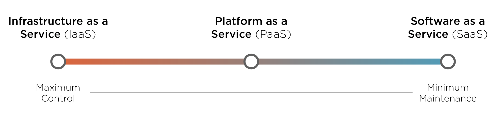
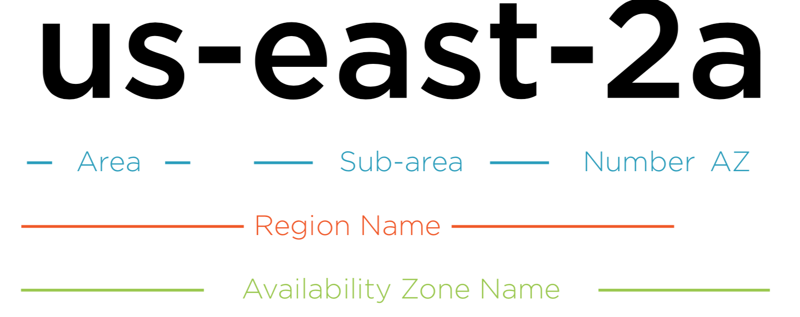

= AWS Cloud Concepts

== Benefits of Cloud Computing

Advantages of Cloud Computing:

* stop guessing capacity
* increase speed and agility
* stop spending money maintaining data centers
* go global in minutes

*Elasticity*

The ability to acquire resources as you need them and release resources when you no longer need them. In the cloud, you want to do this automatically. +
_Source_: https://wa.aws.amazon.com/wellarchitected/2020-07-02T19-33-23/wat.concept.elasticity.en.html[AWA Well-Architected Framework]

*Reliability*

* AWS global infrastructure

*Agility*

* lower the cost of trying new ideas
* Reduces the time required to maintain infrastructure
* Reduces risk for the organization around security and compliance
* Provides access to emerging technologies

== Types of Cloud Computing

*_Cloud computing is the on-demand delivery of compute power, database storage, applications, and other IT resources through a cloud services platform via the Internet with pay-as- you-go pricing._*  - Amazon Web Services

=== Cloud Computing Models

=== Cloud Deployment Models

* *Public Cloud* - Deployed onto a public cloud provider like AWS
* *On-Premises* (Private Cloud) - Cloud-like platform in a private data center
* *Hybrid* - Cloud applications connected to a private data center

== Global Infrastructure

* Regions
* Availability Zones
* Edge locations

=== AWS Regions and Availability Zones

==== AWS Regions

* Each region is in a specific geographic location
* Each geographic location has a cluster of data centers
* AWS currently has 22 launched regions

==== Availability Zones

* Consists of one or more data centers
* Multiple availability zones are included with each AWS Region
* Located within the geographic area of the AWS Region
* Redundant power, networking and connectivity
* There are currently 69 availability zones globally

[NOTE]
====
*Availability*

Extent to which an application is fulfilling its intended business purpose. Applications that are highly-available are built in a manner where a single failure won’t lessen the application’s ability to be fully operational.
====

=== AWS Edge Locations

* Used as nodes of a global content delivery network (CDN)
* Utilized by Amazon CloudFront (Global content delivery network) and Amazon Route 53 (DNS Service)
* Located globally at over 200 different locations
* Allows AWS to serve content from locations closest to users

https://aws.amazon.com/about-aws/global-infrastructure/regions_az/[Infrastructure AWS]

== Cloud Economics

[NOTE]
====
*Capitalized Expenditure (CapEx)*

When building a data center, an organization invests in upfront costs for the building, servers, and supporting equipment. This type of expense to attain a fixed asset is referred to as a Capitalized Expenditure or CapEx.
====

[NOTE]
====
*Operating Expenditure (OpEx)*

The regular day to day expenses of a business are considered Operating Expenditures or OpEx. After the initial build of a data center, ongoing connectivity, utility, and maintenance costs would be considered OpEx.
====

=== Financial Implications

|===
|Manage Your Own Data Center |Leverage Cloud Infrastructure

|Large Up-front Costs (CapEx)
|No Up-front Investment

|Potential for either Under-used Capacity or Unmet Demand
|You Pay as You Go for Infrastructure (OpEx)

|Increasing Capacity Takes Time and Additional Investment (CapEx)
|Capacity Scales to Meet User Demand and Can Be Provisioned Immediately

|Monthly Costs will Map to Predicted Infrastructure Needs
|Monthly Costs will Map to User Demand
|===

=== Organizing and Optimizing AWS Costs

*AWS Cost Explorer*

* Provides predictions for the next three months of costs
* Gives recommendations for cost optimization

==== AWS Budgets

*  It can track cost per service, service usage, reserved instance utilization and coverage, and Savings Plans utilization and coverage.

== Supporting AWS Infrastructure

Supporting Tools:

* AWS Support
* AWS Personal Health Dashboard
* AWS Trusted Advisor

=== AWS Support

* Enables support from AWS resources for workloads running in the cloud
* Provided in different tiers based on need and scope
* Includes tools to provide automated answers and recommendations

=== AWS Personal Health Dashboard

* provides alerts and remediation guidance when AWS is experiencing events that may impact you.

=== AWS Trusted Advisor

* Automated tool to check your AWS usage against best practices
* Accessed from the AWS console
* Different checks are provided based on the AWS Support plan tier
* All AWS customers get access to seven core checks

Trusted Advisor Checks:

* Cost Optimisation
* Performance
* Security
* Fault Tolerance
* Service Limits

=== AWS Support Plan Tiers

AWS Basic Support:

* Provided for all AWS customers
* Access to Trusted Advisor (7 Core
Checks)
* 24x7 Access to customer service, documentation, forums, & whitepapers
* Access to AWS Personal Health Dashboard No monthly cost

AWS Developer Support:

* Includes all features of Basic Support
* Business hours email access to support engineers
* Limited to 1 primary contact
* Starts at $29 per month (tied to AWS usage)

AWS Business Support:

* Includes all features of Developer Support
* Full set of Trusted Advisor checks
* 24x7 phone, email, and chat access to support engineers
* Unlimited contacts
* Provides third-party software support
* Starts at $100 per month (tied to AWS usage)

AWS Enterprise Support:

* Includes all features of Business Support
* Includes designated Technical Account Manager (TAM)
* Includes concierge support team
* Starts at $15,000 per month (tied to AWS usage)

