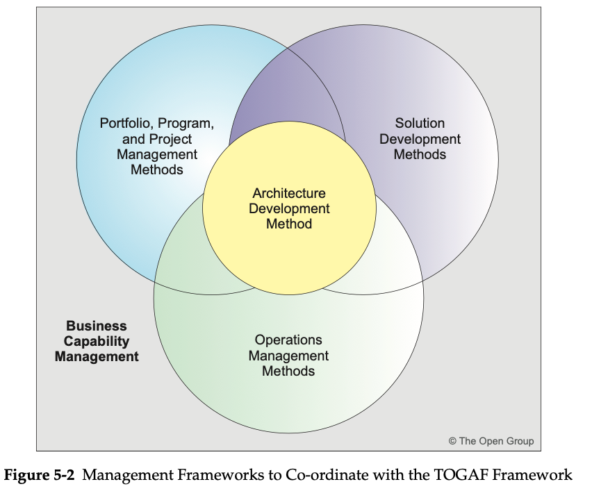
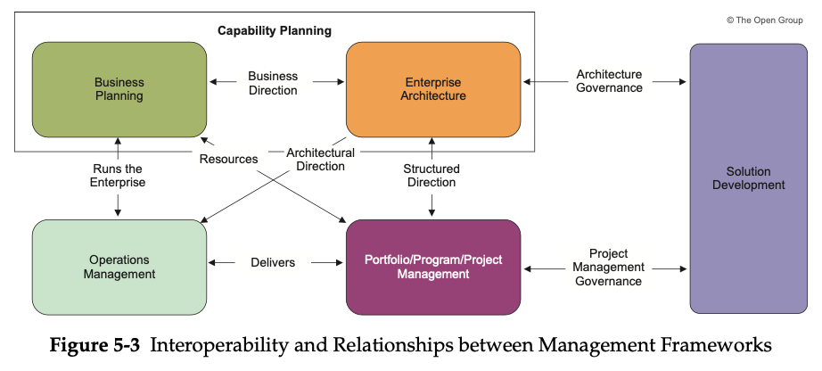

= Preliminary Phase

* Determine the Architecture Capability desired by the organization:
 ** Review the organizational context for conducting Enterprise Architecture
 ** Identify and scope the elements of the enterprise organizations affected by the
Architecture Capability
 ** Identify the established frameworks, methods, and processes that intersect with the Architecture Capability
 ** Establish Capability Maturity target

* Establish the Architecture Capability:
 ** Define and establish the Organizational Model for Enterprise Architecture
 ** Define and establish the detailed process and resources for Architecture Governance
 ** Select and implement tools that support the Architecture Capability
 ** Define the Architecture Principles

== Approach

IMPORTANT: This Preliminary Phase is about defining "where, what, why, who, and how we do architecture" in the enterprise concerned.

The main aspects are as follows:

* Defining the enterprise
* Identifying key drivers and elements in the organizational context
* Defining the requirements for architecture work
* Defining the Architecture Principles that will inform any architecture work
* Defining the framework to be used
* Defining the relationships between management frameworks
* Evaluating the Enterprise Architecture maturity

The Enterprise Architecture provides a strategic, top-down view of an organization to enable executives, planners, architects, and engineers to coherently co-ordinate, integrate, and conduct their activities.

=== Enterprise

A sponsor is appointed at this stage to ensure that the resultant activity has resources to proceed and the clear support of the business management.

=== Organizational Context

* The commercial models for Enterprise Architecture and budgetary plans for Enterprise Architecture activity; where no such plans exist, the Preliminary Phase should be used to develop a budget plan

* The stakeholders for architecture in the enterprise; their key issues and concerns

* The intentions and culture of the organization, as captured within board business directives, business imperatives, business strategies, business principles, business goals, and business drivers

* Current processes that support execution of change and operation of the enterprise, including the structure of the process and also the level of rigor and formality applied within the organization

Areas for focus should include:

* Current methods for architecture description
* Current project management frameworks and methods
* Current systems management frameworks and methods
* Current project portfolio management processes and methods
* Current application portfolio management processes and methods
* Current technology portfolio management processes and methods
* Current information portfolio management processes and methods
* Current systems design and development frameworks and methods

* The Baseline Architecture landscape, including the state of the enterprise and also how the landscape is currently represented in documentation form

* The skills and capabilities of the enterprise and specific organizations that will be adopting the framework

=== Requirements for Architecture Work

The business imperatives behind the Enterprise Architecture work drive the requirements and performance metrics for the architecture work.

* Business requirements
* Cultural aspirations
* Organization intents
* Strategic intent
* Forecast financial requirements

=== Principles

Architecture work is informed by business principles as well as Architecture Principles. The Architecture Principles themselves are also normally based in part on business principles.

The body responsible for governance will also normally be responsible for approving the Architecture Principles, and for resolving architecture issues.

=== Management Frameworks

The main frameworks suggested to be co-ordinated with the TOGAF framework are:

* *Business Capability Management* that determines what business capabilities are required to deliver business value including the definition of return on investment and the requisite control/performance measures
* *Project/Portfolio Management Methods* that determine how a company manages its change initiatives
* *Operations Management Methods* that describe how a company runs its day-to-day operations, including IT
* *Solution Development Methods* that formalize the way that business systems are delivered in accordance with the structures developed in the IT architecture

=== Relating the Management Frameworks

Business planning at the strategy level provides the initial direction to Enterprise Architecture.

Enterprise Architecture structures the business planning into an integrated framework that regards the enterprise as a system or system of systems.

Project/portfolio management is the delivery framework that receives the structured, detailed direction that enables them to plan and build what is required, knowing that each assigned deliverable will be in context.

Operations management receives the deliverables and then integrates and sustains them within the corporate infrastructure.

