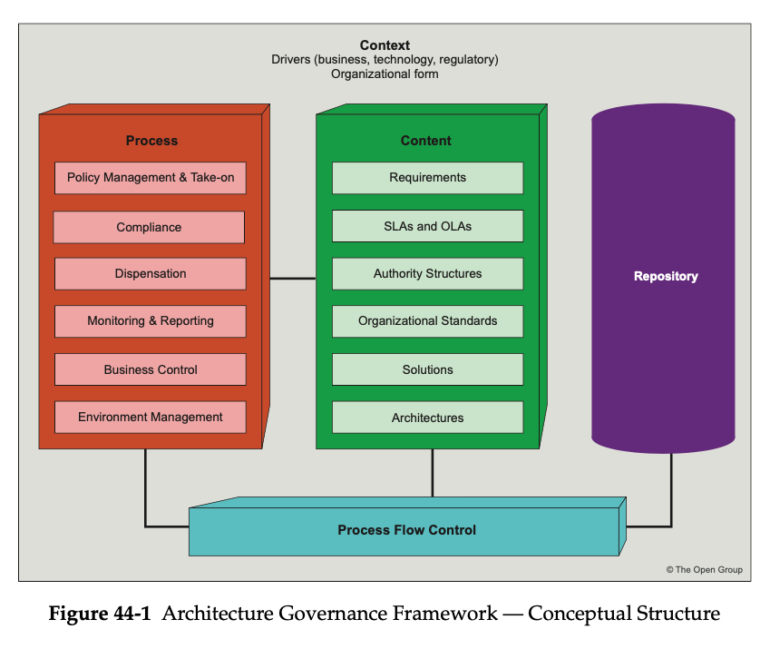

= Architecture governance

== Levels of Governance within the Enterprise

* Corporate Governance
* Technology Governance
* IT Governance
* Architecture Governance

== Basic principles of corporate governance:

* Focuses on the rights, roles, and equitable treatment of shareholders
* Disclosure and transparency and the responsibilities of the board
* Ensures:
    ** Sound strategic guidance of the organization
    ** Effective monitoring of management by the board
    ** Board accountability for the company and to the shareholders
* Board’s responsibilities:
    ** Reviewing and guiding corporate strategy
    ** Setting and monitoring achievement of management’s performance objectives

== Characteristics of Governance

* Discipline
* Transparency
* Independence
* Accountability
* Responsibility

== Technology Governance

* controls how an organization utilizes technology in the research, development, and production of its goods and services.

== IT Governance

* provides the framework and structure that links IT resources and information to enterprise goals and strategies

== Architecture Governance

=== Characteristics

* Implementing a system of controls over the creation and monitoring of all architectural components and activities, to ensure the effective introduction, implementation, and evolution of architectures within the organization
* Implementing a system to ensure compliance with internal and external standards and regulatory obligations
* Establishing processes that support effective management of the above processes within agreed parameters
* Developing practices that ensure accountability to a clearly identified stakeholder community, both inside and outside the organization

== Architecture Governance Framework

