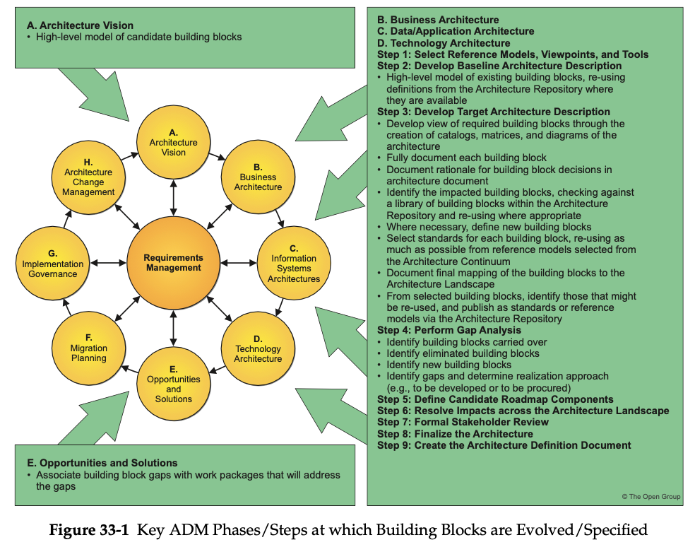

= Building Blocks

== Generic Characteristics

* A building block is a package of functionality defined to meet the business needs across an organization
* A building block has a type that corresponds to the enterprise’s content metamodel (such as actor, business service, application, or data entity)
* A building block has a defined boundary and is generally recognizable as "a thing" by domain experts
* A building block may interoperate with other, inter-dependent building locks.

* A good building block has the following characteristics:
    ** It considers implementation and usage, and evolves to exploit technology and standards
    ** It may be assembled from other building blocks
    ** It may be a subassembly of other building blocks
    ** Ideally a building block is re-usable and replaceable, and well specified

=== Architecture Building Blocks

* Capture architecture requirements; e.g., business, data, application, and technology requirements
* Direct and guide the development of SBBs

ABB specifications include the following as a minimum:

* Fundamental functionality and attributes: semantic, unambiguous, including security capability and manageability
* Interfaces: chosen set, supplied
* Interoperability and relationship with other building blocks
* Dependent building blocks with required functionality and named user interfaces
* Map to business/organizational entities and policies

=== Solution Building Blocks

* Define what products and components will implement the functionality
* Define the implementation
* Fulfil business requirements
* Are product or vendor-aware

SBB specifications include the following as a minimum:

* Specific functionality and attributes
* Interfaces; the implemented set
* Required SBBs used with required functionality and names of the interfaces used
* Mapping from the SBBs to the IT topology and operational policies
* Specifications of attributes shared across the environment (not to be confused with functionality) such as security, manageability, localizability, scalability
* Performance, configurability
* Design drivers and constraints, including the physical architecture
* Relationships between SBBs and ABBs

== Building Blocks and the ADM

=== Building Blocks in Architecture Design

* An architecture need only contain building blocks that are relevant to the business problem that the architecture is attempting to address

* Building blocks may have complex relationships to one another

* Building blocks should conform to standards relevant to their type, the principles of the enterprise, and the standards of the enterprise

=== Building Block Design

Three classes of building blocks:

* Re-usable building blocks, such as legacy items
* Building blocks to be the subject of development, such as new applications
* Building blocks to be the subject of purchase; i.e., Commercial Off-The-Shelf (COTS) applications

