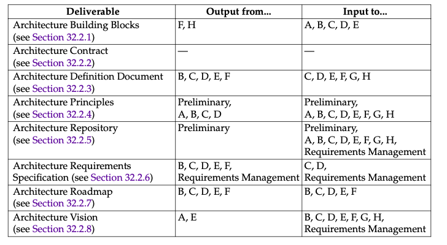
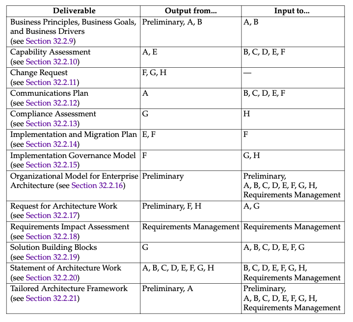

= Architecture Deliverables

== DeliverableDescriptions

=== Architecture Building Blocks

* Architecture documentation and models from the enterprise’s Architecture Repository

=== Architecture Contract

IMPORTANT: the joint agreements between development partners and sponsors on the deliverables, quality, and fitness-for-purpose of an architecture.

==== Content

|===
|Architecture Design and Development Contract|Business Users’ Architecture Contract

|* Introduction and background +
* The nature of the agreement +
* Scope of the architecture +
* Architecture and strategic principles and requirements +
* Conformance requirements +
* Architecture development and management process and roles +
* Target Architecture measures +
* Defined phases of deliverables  +
* Prioritized joint workplan  +
* Time window(s)  +
* Architecture delivery and business metrics +

|* Introduction and background  +
* The nature of the agreement +
* Scope +
* Strategic requirements +
* Conformance requirements +
* Architecture adopters +
* Time window +
* Architecture business metrics +
* Service architecture (includes Service Level Agreement (SLA))

|===

=== Architecture Definition Document

IMPORTANT: spans all architecture domains (business, data, application, and technology) and also examines all relevant states of the architecture (baseline, transition, and target).

The Architecture Definition Document:: provides a *qualitative* view of the solution and aims to communicate the intent of the architects
The Architecture Requirements Specification:: provides a *quantitative* view of the solution, stating measurable criteria that must be met during the implementation of the architecture

==== Content

* Scope
* Goals, objectives, and constraints
* Architecture Principles
* Baseline Architecture
* Architecture models (for each state to be modeled):
 ** Business Architecture models
 ** Data Architecture models
 ** Application Architecture models
 ** Technology Architecture models

* Rationale and justification for architectural approach
* Mapping to Architecture Repository:
 ** Mapping to Architecture Landscape
 ** Mapping to reference models
 ** Mapping to standards
 ** Re-use assessment

* Gap analysis
* Impact assessment
* Transition Architecture:
 ** Definition of transition states
 ** Business Architecture for each transition state
 ** Data Architecture for each transition state
 ** Application Architecture for each transition state
 ** Technology Architecture for each transition state

=== Architecture Principles

IMPORTANT: general rules and guidelines, intended to be enduring and seldom amended, that inform and support the way in which an organization sets about fulfilling its mission.

==== Content

* Business principles
* Data principles
* Application principles
* Technology principles

=== Architecture Repository

*  holding area for all architecture-related projects within the enterprise

=== Architecture Requirements Specification

* a set of *quantitative* statements that outline what an implementation project must do in order to comply with the architecture

==== Content

* Success measures
* Architecture requirements
* Business service contracts
* Application service contracts
* Implementation guidelines
* Implementation specifications
* Implementation standards
* Interoperability requirements
* IT Service Management requirements Constraints
* Assumptions

=== Architecture Roadmap

* lists individual work packages that will realize the Target Architecture and lays them out on a timeline to show progression from the Baseline Architecture to the Target Architecture.

* is incrementally developed throughout Phases E and F

==== Content

* Work package portfolio:
 ** Work package description (name, description, objectives, deliverables)
 ** Functional requirements
 ** Dependencies
 ** Relationship to opportunity
 ** Relationship to Architecture Definition Document and Architecture Requirements Specification
 ** Business value

* Implementation Factor Assessment and Deduction matrix, including:
 ** Risks
 ** Issues
 ** Assumptions
 ** Dependencies
 ** Actions
 ** Inputs

* Consolidated Gaps, Solutions, and Dependencies matrix, including: — Architecture domain
 ** Gap
 ** Potential solutions
 ** Dependencies

* Any Transition Architectures
* Implementation recommendations:
 ** Criteria measures of effectiveness of projects — Risks and issues
 ** Solution Building Blocks (SBBs)

=== Architecture Vision

* a summary of the changes to the enterprise that will accrue from successful deployment of the Target Architecture.

==== Content

* Problem description:
 ** Stakeholders and their concerns
 ** List of issues/scenarios to be addressed
* Objective of the Statement of Architecture Work
* Summary views necessary for the Request for Architecture Work and the Version 0.1 Business, Application, Data, and Technology Architectures created; typically including:
 * Value Chain diagram
 * Solution Concept diagram
* Mapped requirements
* Reference to Draft Architecture Definition Document

=== Business Principles, Business Goals, and Business Drivers

* provide context for architecture work, by describing the needs and ways of working employed by the enterprise.

=== Capability Assessment

==== Content

* Business Capability Assessment:
    ** Capabilities of the business
    ** Baseline state assessment of the performance level of each capability
    ** Future state aspiration for the performance level of each capability
    ** Baseline state assessment of how each capability is realized
    ** Future state aspiration for how each capability should be realized
    ** Assessment of likely impacts to the business organization resulting from the successful deployment of the Target Architecture

* IT Capability Assessment:
    ** Baseline and target maturity level of change process
    ** Baseline and target maturity level of operational processes
    ** Baseline capability and capacity assessment
    ** Assessment of the likely impacts to the IT organization resulting from the successful deployment of the Target Architecture

* Architecture maturity assessment

 ** Architecture Governance processes, organization, roles, and responsibilities
 ** Architecture skills assessment
 ** Breadth, depth, and quality of landscape definition with the Architecture Repository
 ** Breadth, depth, and quality of standards definition with the Architecture Repository
 ** Breadth, depth, and quality of reference model definition with the Architecture Repository
 ** Assessment of re-use potential

* Business Transformation Readiness Assessment

 ** Readiness factors
 ** Vision for each readiness factor
 ** Current and target readiness ratings
 ** Readiness risks

=== Change Request

==== Content

* Description of the proposed change
* Rationale for the proposed change
* Impact assessment of the proposed change, including:
    ** Reference to specific requirements
    ** Stakeholder priority of the requirements to date
    ** Phases to be revisited
    ** Phase to lead on requirements prioritization
    ** Results of phase investigations and revised priorities
    ** Recommendations on management of requirements
* Repository reference number

=== Communications Plan

==== Content

* Identification of stakeholders and grouping by communication requirements
* Identification of communication needs, key messages in relation to the Architecture Vision, communication risks, and CSFs
* Identification of mechanisms that will be used to communicate with stakeholders and allow access to architecture information, such as meetings, newsletters, repositories, etc.
* Identification of a communications timetable, showing which communications will occur with which stakeholder groups at what time and in what location

=== Compliance Assessment

==== Content

* Overview of project progress and status
* Overview of project architecture/design
* Completed architecture checklists:
 ** Hardware and operating system checklist
 ** Software services and middleware checklist
 ** Applications checklists
 ** Information management checklists
 ** Security checklists
 ** System management checklists
 ** System engineering checklists
 ** Methods and tools checklists

=== Implementation and Migration Plan

* a schedule of the projects that will realize the Target Architecture.
* includes executable projects grouped into managed portfolios and programs.

==== Content

* Implementation and Migration Strategy:
 ** Strategic implementation direction
 ** Implementation sequencing approach

* Project and portfolio breakdown of implementation:
 ** Allocation of work packages to project and portfolio — Capabilities delivered by projects
 ** Milestones and timing
 ** Work breakdown structure
 ** May include impact on existing portfolio, program, and projects

=== Implementation Governance Model

* Governance processes
* Governance organization structure
* Governance roles and responsibilities
* Governance checkpoints and success/failure criteria

=== Organizational Model for Enterprise Architecture

==== Content

* Scope of organizations impacted
* Maturity assessment, gaps, and resolution approach
* Roles and responsibilities for architecture team(s)
* Constraints on architecture work
* Budget requirements
* Governance and support strategy

=== Request for Architecture Work

* can be created as an output of the Preliminary Phase

==== Content

* Organization sponsors
* Organization’s mission statement
* Business goals (and changes)
* Strategic plans of the business
* Time limits
* Changes in the business environment
* Organizational constraints
* Budget information, financial constraints
* External constraints, business constraints
* Current business system description
* Current architecture/IT system description
* Description of developing organization
* Description of resources available to developing organization

=== Requirements Impact Assessment

==== Content

* Reference to specific requirements
* Stakeholder priority of the requirements to date
* Phases to be revisited
* Phase to lead on requirements prioritization
* Results of phase investigations and revised priorities
* Recommendations on management of requirements
* Repository reference number

=== Solution Building Blocks

Implementation-specific building blocks from the enterprise’s Architecture Repository

=== Statement of Architecture Work

==== Content

* Title
* Architecture project request and background
* Architecture project description and scope
* Overview of Architecture Vision
* Specific change of scope procedures
* Roles, responsibilities, and deliverables
* Acceptance criteria and procedures
* Architecture project plan and schedule
* Approvals

=== Tailored Architecture Framework

* Tailored architecture method
* Tailored architecture content (deliverables and artifacts)
* Configured and deployed tools
* Interfaces with governance models and other frameworks:
 ** Corporate Business Planning
 ** Enterprise Architecture
 ** Portfolio, Program, Project Management — System Development/Engineering
 ** Operations (Services)

