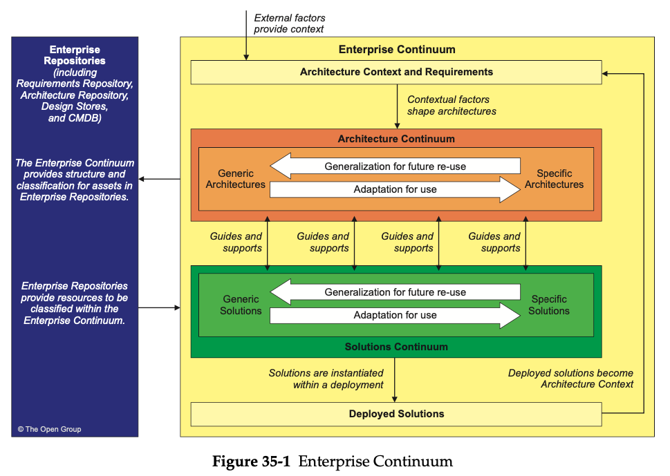

= Enterprise Continuum

IMPORTANT: *a view of the repository of all the architecture assets*

*Enterprise Continuum*:: outermost continuum and classifies assets related to the context of the overall Enterprise Architecture

*Architecture Continuum*:: a consistent way to define and understand the generic rules, representations, and relationships in an architecture, including traceability and derivation relationships

*Solutions Continuum*:: a consistent way to describe and understand the implementation of the assets defined in the Architecture Continuum

