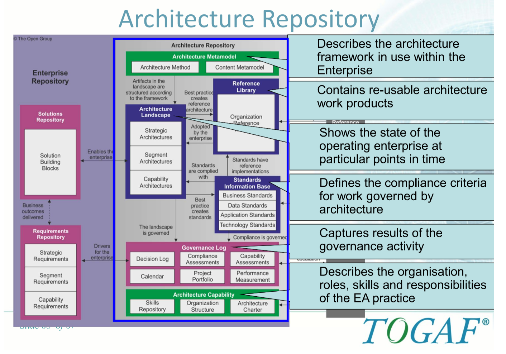
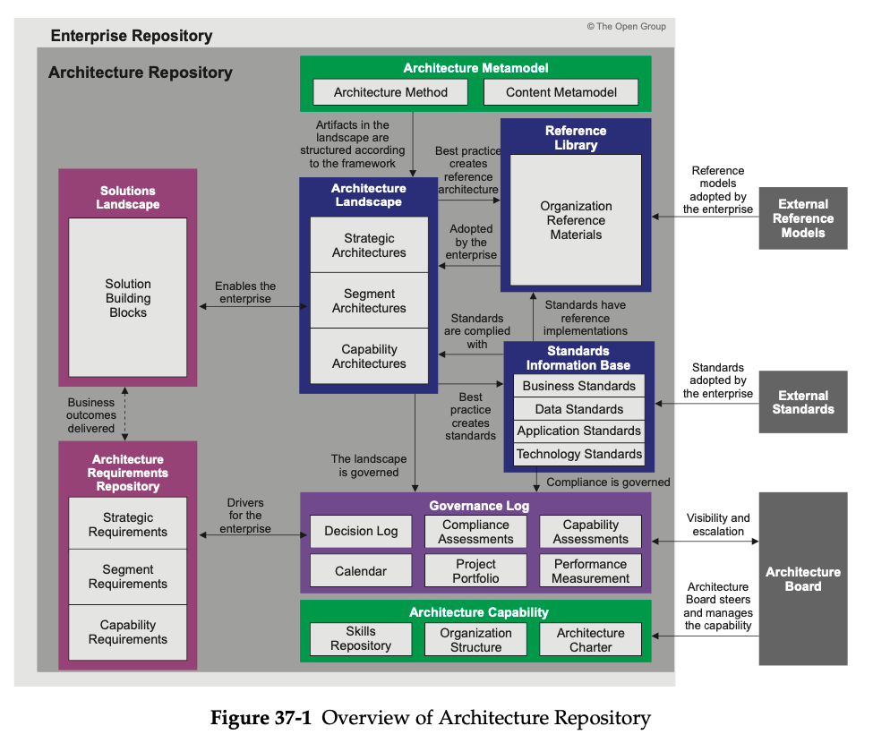
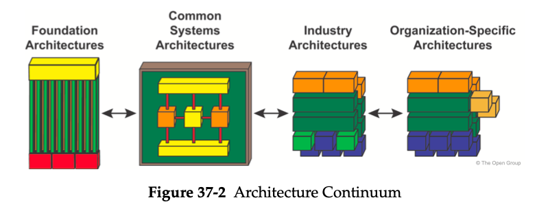

= Architecture Repository

Classes of architectural information:

Architecture Metamodel:: describes the organizationally tailored application of an architecture framework, including a method for architecture development and a metamodel for architecture content

Architecture Capability:: defines the parameters, structures, and processes that support governance of the Architecture Repository

Architecture Landscape:: presents an architectural representation of assets in use, or planned, by the enterprise at particular points in time

Standards Information Base:: captures the standards with which new architectures must comply, which may include industry standards, selected products and services from suppliers, or shared services already deployed within the organization

Reference Library:: provides guidelines, templates, patterns, and other forms of reference material that can be leveraged in order to accelerate the creation of new architectures for the enterprise

Governance Log:: provides a record of governance activity across the enterprise

Architecture Requirements Repository:: provides a view of all authorized architecture
requirements which have been agreed with the Architecture Board

Solutions Landscape:: presents an architectural representation of the Solution Building Blocks (SBBs) supporting the Architecture Landscape which have been planned or deployed by the enterprise

== Architecture Landscape
*Strategic Architectures*

* show a *long-term summary view of the entire enterprise*.
* provide an organizing framework for operational and change activity and allow for direction setting at an executive level.

*Segment Architectures*

* provide more detailed operating models for areas within an enterprise.
* can be used at the program or portfolio level to organize and operationally align more detailed change activity.

*Capability Architectures*

* show in a more detailed fashion how the enterprise can support a particular unit of capability.
* are used to provide an overview of current capability, target capability, and capability increments and allow for individual work packages and projects to be grouped within managed portfolios and programs.

== Reference Library

The Reference Library should contain:

* Reference Architectures
* Reference Models
* Viewpoint Library
* Templates

== Standards Information Base

=== Types of Standard

 Legal and Regulatory Obligations:: these standards are mandated by law and therefore an enterprise must comply or face serious consequences

 Industry Standards:: these standards are established by industry bodies, such as The Open Group, and are then selected by the enterprise for adoption

 Organizational Standards:: these standards are set within the organization and are based on business aspiration (e.g., selection of standard applications to support portfolio consolidation)

== GovernanceLog

 Decision Log:: a log of all architecturally significant decisions that have been made in the organization

This would typically include:

* Product selections
* Justification for major architectural features of projects
* Standards deviations
* Standards lifecycle changes
* Change Request evaluations and approvals
* Re-use assessments

Compliance Assessments:: at key checkpoint milestones in the progress of a project, a formal architecture review will be carried out

* Project overview
* Progress overview (timeline, status, issues, risks, dependencies, etc.) — Completed architecture checklists
* Standards compliance assessment
* Recommended actions

Capability Assessments:: depending on their objectives, some projects will carry out assessments of business, IT, or Architecture Capability

* Templates and reference models for executing Capability Assessments
* Business Capability Assessments
* IT capability, maturity, and impact assessments
* Architecture maturity assessments

Calendar:: the Calendar should show a schedule of in-flight projects and formal review sessions to be held against these projects

Project Portfolio:: the Project Portfolio should hold summary information about all in- flight projects that fall under Architecture Governance, including:

* The name and description of the project
* Architectural scope of the project
* Architectural roles and responsibilities associated with the project

Performance Measurement:: based on a charter for the architecture function, a number of performance criteria will typically be defined

== Architecture Requirements Repository

* *Strategic Architecture Requirements* show a long-term summary view of the requirements for the entire enterprise.

Strategic Architecture Requirements identify operational and change requirements for direction setting at an executive level.

* *Segment Architecture Requirements* provide more detailed operating model requirements for areas within an enterprise.

Segment Architecture Requirements may identify requirements at the program or portfolio level to identify and align more detailed change activity.

* *Capability Architecture Requirements* identify the detailed requirements for a particular unit of capability.
Capability Architecture Requirements identify requirements for individual work packages and projects to be grouped within managed portfolios and programs.

== Solutions Landscape

* holds the Solution Building Blocks (SBBs) which support the Architecture Building Blocks (ABBs) specified, developed, and deployed.

The building blocks may be products or services which may be categorized according to the Enterprise Continuum categorization and/or the ABB specifications as Strategic, Segment, or Capability SBBs.

== The Enterprise Repository

* development repositories, specific operating environments, instructions, and configuration management repositories.

