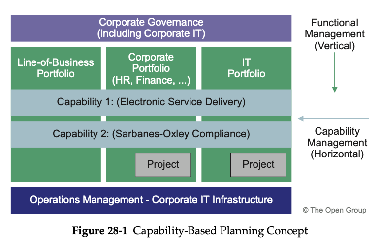
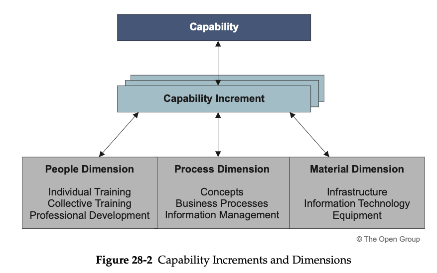
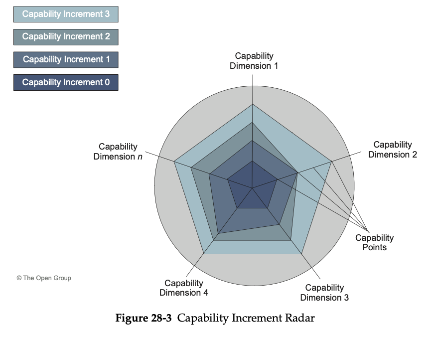
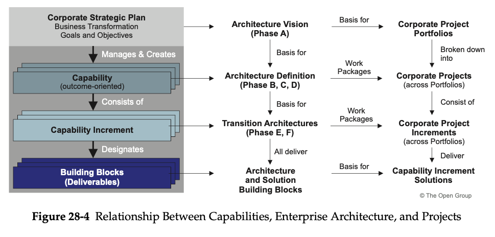

= Capability-Based Planning

* focuses on the planning, engineering, and delivery of strategic business capabilities to the enterprise

* It is business-driven and business-led and combines the requisite efforts of all lines of business to achieve the desired capability

* Capabilities are business-driven and ideally business-led

* many capabilities are "horizontal" and go against the grain of normal vertical corporate governance

== Capability Dimensions

=== Capability Increments

A capability will take an extended time to deliver and will normally involve many projects delivering numerous increments.

* it is useful to break the capability into capability increments that deliver discrete, visible, and quantifiable outcomes as well as providing the focus for Transition Architectures and the deliverables from numerous inter- dependent projects.

The *Capability Increment "Radar" diagram* is a proven approach to describing how a capability will evolve over time.

* The architect selects the aspects of capability that are important to the stakeholder community as lines radiating from the center.

* Against each line, the architect draws points that represent significant "capability points" ("lower" capability points nearest the center; "higher" capability points farthest from the center). With these "markers" in place the architect can, by joining up the capability points into a closed loop, demonstrate in a simple form how each "capability increment" will extend on the previous increment.

