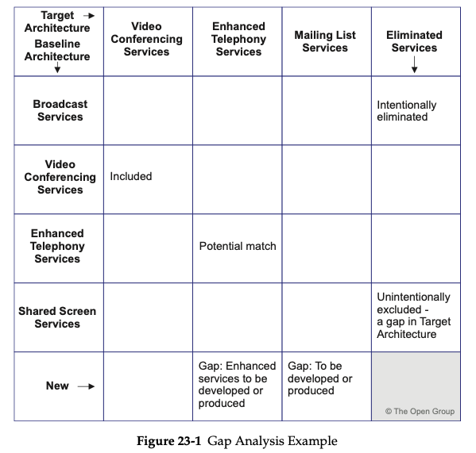

= Gap Analysis

Potential sources of gaps include:

* Business domain gaps:
    ** People gaps (e.g., cross-training requirements)
    ** Process gaps (e.g., process inefficiencies)
    ** Tools gaps (e.g., duplicate or missing tool functionality)
    ** Information gaps
    ** Measurement gaps
    ** Financial gaps
    ** Facilities gaps (buildings, office space, etc.)
■ Data domain gaps:
    ** Data not of sufficient currency
    ** Data not located where it is needed
    ** Not the data that is needed
    ** Data not available when needed
    ** Data not created
    ** Data not consumed
    ** Data relationship gaps
    ** Applications impacted, eliminated, or created
    ** Technologies impacted, eliminated, or created

* Draw up a matrix with all the Architecture Building Blocks (ABBs) of the Baseline Architecture on the vertical axis, and all the ABBs of the Target Architecture on the horizontal axis
* Add to the Baseline Architecture axis a final row labeled "New", and to the Target Architecture axis a final column labeled "Eliminated"
* Where an ABB is available in both the Baseline and Target Architectures, record this with "Included" at the intersecting cell
* Where an ABB from the Baseline Architecture is missing in the Target Architecture, each must be reviewed
If it was correctly eliminated, mark it as such in the appropriate "Eliminated" cell. If it was not, an accidental omission in the Target Architecture has been uncovered that must be addressed by reinstating the ABB in the next iteration of the architecture design — mark it as such in the appropriate "Eliminated" cell.
* Where an ABB from the Target Architecture cannot be found in the Baseline Architecture, mark it at the intersection with the "New" row as a gap that needs to filled, either by developing or procuring the building block

