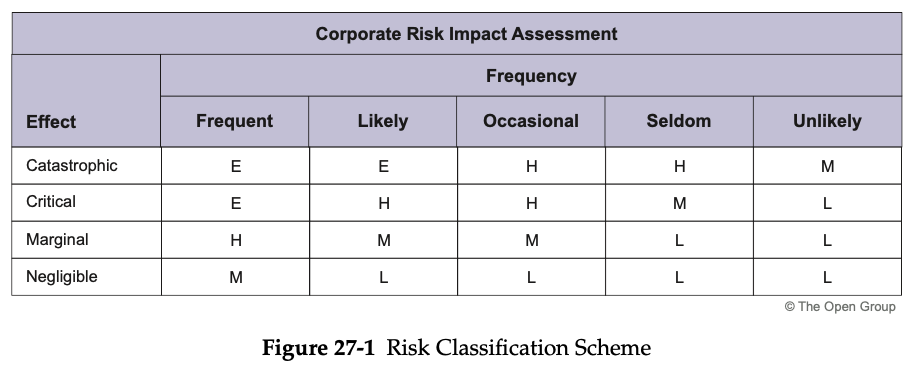

= Risk Management

Initial Level of Risk:: risk categorization prior to determining and implementing mitigating actions
Residual Level of Risk:: risk categorization after implementation of mitigating actions (if any)

== Risk Classification

* is present in all phases within the Architecture Development Method (ADM).

Risks are normally classified: as time (schedule), cost (budget), and scope but they could also include client transformation relationship risks, contractual risks, technological risks, scope and complexity risks, environmental (corporate) risks, personnel risks, and client acceptance risks.

== Risk Identification

The use of *Capability Maturity Models* (CMMs) is suitable for specific factors associated with architecture delivery to first identify baseline and target states and then identify the actions required to move to the target state. The implications of not achieving the target state can result in the discovery of risks.

== Initial Risk Assessment

Catastrophic:: infers critical financial loss that could result in bankruptcy of the organization

Critical:: infers serious financial loss in more than one line of business leading to a loss in productivity and no return on investment on the IT investment

Marginal:: infers a minor financial loss in a line of business and a reduced return on investment on the IT investment

Negligible:: infers a minimal impact on a line of business’ ability to deliver services and/or products

Frequency could be indicated as follows:

* *Frequent*: likely to occur very often and/or continuously
* *Likely*: occurs several times over the course of a transformation cycle
* *Occasional*: occurs sporadically
* *Seldom*: remotely possible and would probably occur not more than once in the course of a transformation cycle
* *Unlikely*: will probably not occur during the course of a transformation cycle

A potential scheme to assess corporate impact could be as follows:

 Extremely High Risk (E):: the transformation effort will most likely fail with severe consequences
 High Risk (H):: significant failure of parts of the transformation effort resulting in certain goals not being achieved
 Moderate Risk (M):: noticeable failure of parts of the transformation effort threatening the success of certain goals
 Low Risk (L):: certain goals will not be wholly successful

== Risk Mitigation and Residual Risk Assessment

The mitigation effort could be a simple monitoring and/or acceptance of the risk to a full-blown contingency plan calling for complete redundancy in a Business Continuity Plan (with all of the associated scope, cost, and time implications).

== Conduct Residual Risk Assessment

Once the mitigation effort has been identified for each one of the risks, re-assess the effect and frequency and then recalculate the impacts and see whether the mitigation effort has really made an acceptable difference.

== Risk Monitoring and Governance (Phase G)

The residual risks have to be approved by the IT governance framework and potentially in corporate governance where business acceptance of the residual risks is required.

The risk identification and mitigation assessment worksheets are maintained as governance artifacts and are kept up-to-date in Phase G (Implementation Governance) where risk monitoring is conducted.

